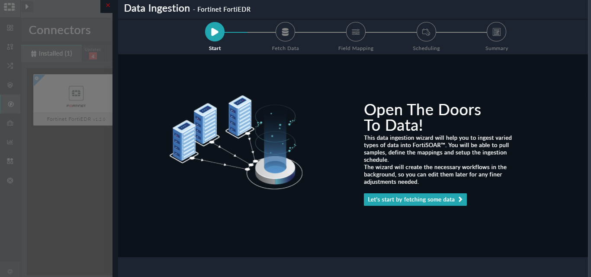
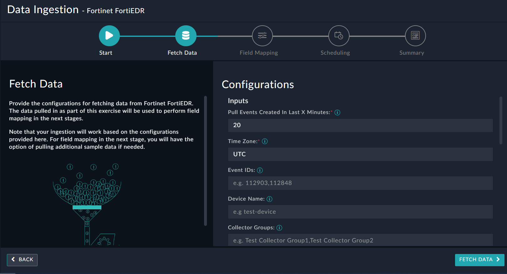
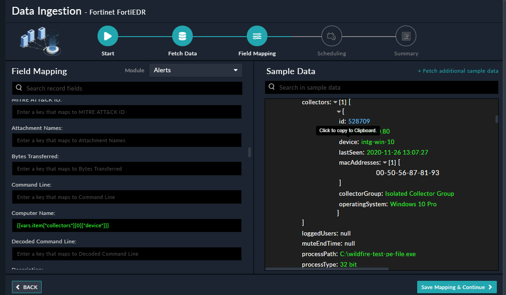
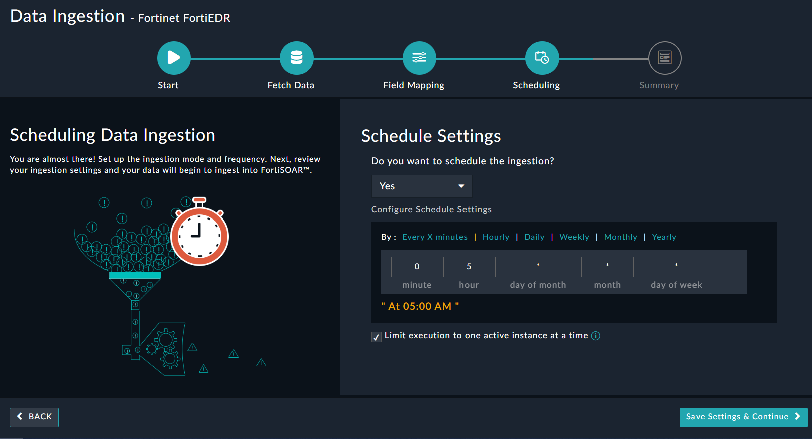

<h2>About the connector</h2>

FortiEDR protects endpoints pre- and post-infection, stops data breaches in real time, and automatically orchestrates incident investigation and response.

This document provides information about the Fortinet FortiEDR Connector, which facilitates automated interactions, with your Fortinet FortiEDR server using FortiSOAR&trade; playbooks. Add the Fortinet FortiEDR Connector, as a step in FortiSOAR&trade; playbooks and perform automated operations such as retrieving events from Fortinet FortiEDR, searching for a file hash among the current events, threat hunting repository, and communicating applications that exist in the Fortinet FortiEDR system, and isolating a collector from the Fortinet FortiEDR network

Use the Data Ingestion Wizard to ingest data into FortiSOAR&trade; by pulling events from Fortinet FortiEDR. Currently, "events" in Fortinet FortiEDR are mapped to "alerts" in FortiSOAR&trade;. For more information, see the <a href="#dataIngestion">Data Ingestion Support</a> section.

<h3>Version information</h3>

Connector Version: 2.0.0

FortiSOAR&trade; Version Tested on: 7.5.0-4015

Fortinet FortiEDR Version Tested on: 6.2.0.0436

Authored By: Fortinet

Certified: Yes

<h2>Release Notes for version 2.0.0</h2>

Following enhancements have been made to the Fortinet FortiEDR Connector in version 2.0.0:

<ul>
    <li>Added a new parameter <strong>Organization</strong> in connector configuration.</li>
    <li>Added the following new operations and playbooks:
        <ul>
            <li>Get Organizations</li>
            <li>Move Collectors</li>
        </ul>
    </li>
    <li>Added parameters <em>Severities</em>, <em>Device Control</em>, and <em>Expired</em> in the following actions:
        <ul>
            <li>Get Events</li>
            <li>Get Event List Extended</li>
        </ul>
    </li>
    <li>Added parameters <em>Device Control</em> and <em>Expired</em> in the following actions:
        <ul>
            <li>Update Events</li>
            <li>Get Event Count</li>
        </ul>
    </li>
    <li>Added the following parameters to the action <strong>Get Exception List</strong>:
        <ul>
            <li>Exception IDs</li>
            <li>Rules</li>
            <li>Collector Groups</li>
            <li>Process</li>
            <li>Path</li>
            <li>Comment</li>
            <li>Destination IP</li>
            <li>User</li>
        </ul>
    </li>
    <li>Added a new parameter <em>Raw Event IDs</em> in the action <strong>Get Raw Data Items</strong>.</li>
    <li>Added a new parameter <strong>Organization</strong> parameter in the action <strong><em>Search File Hash</em></strong>.</li>
    <li>Updated the output schema for the following actions:
        <ul>
            <li>Get Event by ID</li>
            <li>Get Events</li>
            <li>Update Events</li>
            <li>Get Collector List</li>
            <li>Get Event Exceptions</li>
        </ul>
    </li>
    <li>Following changes have been made for the parameter <strong><em>Field to Update on Event</em></strong> of the action <strong>Update Events</strong>:
        <ul>
            <li>Added the following new options:
                <ul>
                    <li>Family Name</li>
                    <li>Malware Type</li>
                    <li>Threat Name</li>
                </ul>
            </li>
            <li>The field type has been changed to <em>Multiselect</em>.</li>
        </ul>
    </li>
    <li>Updated the options to include <em>Pending Migration </em> in the parameter <strong><em>States</em></strong> of the action <strong>Get Collector List</strong>.</li>
    <li>In the action <strong>Get Raw JSON Event Data</strong>, renamed the parameter <em>Event ID</em> to <strong><em>Raw Event ID</em></strong>.</li>
    <li>To accommodate changes in the API, the maximum permissible value for the parameter <strong>Items Per Page</strong> in the following actions is now <strong><code>1000</code></strong>:
        <ul>
            <li>Get Events</li>
            <li>Get Raw Data Items</li>
            <li>Get Event Count</li>
            <li>Get Event List Extended</li>
            <li>Get Collector List</li>
        </ul>
    </li>
</ul>

<h2>Installing the connector</h2>

Use the <strong>Content Hub</strong> to install the connector. For the detailed procedure to install a connector, click <a href="https://docs.fortinet.com/document/fortisoar/0.0.0/installing-a-connector/1/installing-a-connector" target="_top">here</a>.

You can also use the <code>yum</code> command as a root user to install the connector:

<pre>yum install cyops-connector-fortinet-fortiedr</pre>

<h2>Prerequisites to configuring the connector</h2>

<ul>
    <li>You must have the URL of the Fortinet FortiEDR server to which you will connect and perform automated operations and credentials (username-password pair) to access that server.</li>
    <li>Users who have to use the Fortinet FortiEDR must be assigned a role with "REST API Access".</li>
    <li>To access the FortiSOAR&trade; UI, ensure that port 443 is open through the firewall for the FortiSOAR&trade; instance.</li>
</ul>

<h2>Minimum Permissions Required</h2>

<ul>
    <li>Not applicable.</li>
</ul>

<h2>Configuring the connector</h2>

For the procedure to configure a connector, click <a href="https://docs.fortinet.com/document/fortisoar/0.0.0/configuring-a-connector/1/configuring-a-connector" rel="noopener noreferrer" target="_blank">here</a>.

<h3>Configuration parameters</h3>

In FortiSOAR&trade;, on the <strong>Content Hub</strong> (or Connector Store) page, click the <strong>Manage</strong> tab, and then click the <strong>Fortinet FortiEDR</strong> connector card. On the connector popup, click the <strong>Configurations</strong> tab to enter the required configuration details.

<table border="1">
    <thead>
        <tr>
            <th>Parameter</th>
            <th>Description</th>
        </tr>
    </thead>
    <tbody>
        <tr>
            <td>Server URL</td>
            <td>URL of the Fortinet FortiEDR server to which you will connect and perform the automated operations.</td>
        </tr>
        <tr>
            <td>Username</td>
            <td>Username that contains a Rest API role and using which you will access the Fortinet FortiEDR server to which you will connect and perform the automated operations. 
                <strong>Note</strong>: The username must contain the FortiEDR TenantID in the following format: <code>&lt;TenantID&gt;\username</code>
            </td>
        </tr>
        <tr>
            <td>Password</td>
            <td>Password used to access the FortiEDR server to which you will connect and perform the automated operations.</td>
        </tr>
        <tr>
            <td>Organization</td>
            <td>Specify the organization name using which you will access the Fortinet FortiEDR server. The organization <em>must</em> be specified in a multi-tenancy environment.</td>
        </tr>
        <tr>
            <td>Verify SSL</td>
            <td>Specifies whether the SSL certificate for the server is to be verified. 
                By default, this option is selected, i.e., set to <code>true</code>.</td>
        </tr>
    </tbody>
</table>

<h2>Actions supported by the connector</h2>

The following automated operations can be included in playbooks, and you can also use the annotations to access operations from version 4.10.0 onwards:

<table border="1">
    <thead>
        <tr>
            <th>Function</th>
            <th>Description</th>
            <th>Annotation and Category</th>
        </tr>
    </thead>
    <tbody>
        <tr>
            <td>Get Event by ID</td>
            <td>Retrieves a specific event from Fortinet FortiEDR based on the event ID you have specified.</td>
            <td>get_event_list 
                Investigation</td>
        </tr>
        <tr>
            <td>Get Events</td>
            <td>Retrieves all the events from Fortinet FortiEDR that match the condition(s) you have specified. 
                <strong>Note</strong>: If none of the input parameters that you specify match the events in Fortinet FortiEDR, then an empty result set is returned.
            </td>
            <td>get_event 
                Investigation</td>
        </tr>
        <tr>
            <td>Update Events</td>
            <td>Updates events in Fortinet FortiEDR that match the condition(s) you have specified. 
                <strong>Note</strong>: If none of the input parameters that you specify match the events in Fortinet FortiEDR, then an empty result set is returned.
            </td>
            <td>update_event 
                Investigation</td>
        </tr>
        <tr>
            <td>Get Raw Data Items</td>
            <td>Retrieves the raw data items from Fortinet FortiEDR based on the event ID and other input parameters you have specified.</td>
            <td>get_raw_data_items 
                Investigation</td>
        </tr>
        <tr>
            <td>Get Event Count</td>
            <td>Retrieves the event count from Fortinet FortiEDR based on the filter parameters you have specified.</td>
            <td>get_event_count 
                Investigation</td>
        </tr>
        <tr>
            <td>Get Event List Extended</td>
            <td>Retrieves archived/unarchived events together from Fortinet FortiEDR based on the filter parameters you have specified. 
                <strong>Note</strong>: If none of the input parameters that you specify match the events in Fortinet FortiEDR, then an empty result set is returned.
            </td>
            <td>get_event_list 
                Investigation</td>
        </tr>
        <tr>
            <td>Search Filehash</td>
            <td>Searches a file hash among the current events, threat hunting repository, and communicating applications that exist in the Fortinet FortiEDR system.</td>
            <td>search_filehash 
                Investigation</td>
        </tr>
        <tr>
            <td>Get File</td>
            <td>Retrieves a specific file from the specified device from Fortinet FortiEDR, based on the device type, device name/ID, and file paths you have specified, and adds it as an attachment in the "Attachments" module</td>
            <td>get_file 
                Investigation</td>
        </tr>
        <tr>
            <td>Retrieve File or Memory</td>
            <td>Retrieves a file or memory related to a specific event from Fortinet FortiEDR based on the raw event ID and other input parameters you have specified and adds it as an attachment in the "Attachments" module.</td>
            <td>get_event_file 
                Investigation</td>
        </tr>
        <tr>
            <td>Remediate Device</td>
            <td>Takes remedial actions on Fortinet FortiEDR such as killing a process, deleting a file and/or cleaning persistent data on which malware was detected based on the device type, device name/ID, and other input parameters you have specified.</td>
            <td>remediate_device 
                Remediation</td>
        </tr>
        <tr>
            <td>Get Collector List</td>
            <td>Retrieves the list of the collectors from Fortinet FortiEDR based on the device names or IDs, and other input parameters you have specified.</td>
            <td>get_collector_list 
                Investigation</td>
        </tr>
        <tr>
            <td>Isolate Collector</td>
            <td>Isolates a collector from the Fortinet FortiEDR network based on the list of device IDs or names, and other input parameters you have specified.</td>
            <td>isolate_collector 
                Investigation</td>
        </tr>
        <tr>
            <td>Unisolate Collector</td>
            <td>Unisolates a collector from the Fortinet FortiEDR network based on the device ID and other input parameters you have specified.</td>
            <td>isolate_collector 
                Investigation</td>
        </tr>
        <tr>
            <td>Create Exception</td>
            <td>Creates a new exception in Fortinet FortiEDR based on the event ID and other input parameters you have specified.</td>
            <td>create_exception 
                Investigation</td>
        </tr>
        <tr>
            <td>Get Exception List</td>
            <td>Retrieves the list of all exceptions or specific exceptions from Fortinet FortiEDR based on the input parameters you have specified.</td>
            <td>list_exception 
                Investigation</td>
        </tr>
        <tr>
            <td>Update Exception</td>
            <td>Updates a specific exception in Fortinet FortiEDR based on the event ID, exception ID, and other input parameters you have specified.</td>
            <td>update_exception 
                Investigation</td>
        </tr>
        <tr>
            <td>Get Event Exceptions</td>
            <td>Retrieves the list of event exceptions from Fortinet FortiEDR based on the event ID and other input parameters you have specified.</td>
            <td>get_event_exceptions 
                Investigation</td>
        </tr>
        <tr>
            <td>Get Raw JSON Event Data</td>
            <td>Retrieve the raw data of specific events from Fortinet FortiEDR based on the event ID and other input parameters you have specified.</td>
            <td>get_raw_json_event_data 
                Investigation</td>
        </tr>
        <tr>
            <td>Create IPSet</td>
            <td>Creates an IPSet in Fortinet FortiEDR using the set of IP addresses and other parameters you have specified.</td>
            <td>create_ipset 
                Investigation</td>
        </tr>
        <tr>
            <td>Get IPSet List</td>
            <td>Retrieves a list of IPSets from Fortinet FortiEDR based on the IP address and other input parameters you have specified.</td>
            <td>get_ipset_list 
                Investigation</td>
        </tr>
        <tr>
            <td>Update IPSet</td>
            <td>Updates IP addresses in the specific IPSet in Fortinet FortiEDR using the set of IP addresses, the IPSet name, and other parameters you have specified.</td>
            <td>update_ipset 
                Investigation</td>
        </tr>
        <tr>
            <td>Delete IPSet</td>
            <td>Deletes specific IPSets from Fortinet FortiEDR based on the IPSet names and other input parameters you have specified.</td>
            <td>delete_ipset 
                Investigation</td>
        </tr>
        <tr>
            <td>Get Agent Groups</td>
            <td>Retrieves a list of all agent group lists from Fortinet FortiEDR.</td>
            <td>get_agent_group 
                Investigation</td>
        </tr>
        <tr>
            <td>Get System Summary</td>
            <td>Retrieves a summary of the environment from Fortinet FortiEDR.</td>
            <td>get_system_summary 
                Investigation</td>
        </tr>
        <tr>
            <td>Get Organizations</td>
            <td>Retrieves a detailed list of organizations from the FortiEDR server.</td>
            <td>get_organizations  Investigation</td>
        </tr>
        <tr>
            <td>Move Collectors</td>
            <td>Move collectors between organizations based on the collectors, target collectors group, and other input parameters that you have specified.</td>
            <td>move_collectors  Investigation</td>
        </tr>
    </tbody>
</table>

<h3>operation: Get Event by ID</h3>

<h4>Input parameters</h4>

<table border="1">
    <thead>
        <tr>
            <th>Parameter</th>
            <th>Description</th>
        </tr>
    </thead>
    <tbody>
        <tr>
            <td>Event ID</td>
            <td>ID of the event that you want to retrieve from Fortinet FortiEDR.
                
<strong>NOTE</strong>: You can get event IDs using the <strong><em>Get Events</em></strong> action.

            </td>
        </tr>
    </tbody>
</table>

<h4>Output</h4>

The output contains the following populated JSON schema:

<pre>[
    {
        "action": "",
        "archived": "",
        "certified": "",
        "classification": "",
        "collectors": [
            {
                "collectorGroup": "",
                "device": "",
                "id": "",
                "ip": "",
                "lastSeen": "",
                "macAddresses": [],
                "operatingSystem": ""
            }
        ],
        "comment": "",
        "destinations": [],
        "eventId": "",
        "firstSeen": "",
        "handled": "",
        "lastSeen": "",
        "loggedUsers": [],
        "muteEndTime": "",
        "muted": "",
        "organization": "",
        "process": "",
        "processOwner": "",
        "processPath": "",
        "processType": "",
        "rules": [],
        "seen": "",
        "severity": "",
        "threatDetails": {
            "threatFamily": "",
            "threatName": "",
            "threatType": ""
        }
    }
]</pre>

<h3>operation: Get Events</h3>

<h4>Input parameters</h4>

<strong>Note</strong>: All the input parameters are optional. However, if you do not specify any parameter, then no filter criterion is applied, and an unfiltered list is returned.

<table border="1">
    <thead>
        <tr>
            <th>Parameter</th>
            <th>Description</th>
        </tr>
    </thead>
    <tbody>
        <tr>
            <td>Event IDs</td>
            <td>List of event IDs based on which you want to retrieve events from Fortinet FortiEDR.</td>
        </tr>
        <tr>
            <td>Device Name</td>
            <td>Name of the device on which the events occurred that you want to retrieve from Fortinet FortiEDR.</td>
        </tr>
        <tr>
            <td>Collector Groups</td>
            <td>List of collector groups whose collector had reported the events that you want to retrieve from Fortinet FortiEDR.</td>
        </tr>
        <tr>
            <td>Operating System</td>
            <td>Name of the operating system of the devices on which the events occurred that you want to retrieve from Fortinet FortiEDR.</td>
        </tr>
        <tr>
            <td>Device IPs</td>
            <td>List of IP addresses of the devices on which the events occurred that you want to retrieve from Fortinet FortiEDR.</td>
        </tr>
        <tr>
            <td>MAC Addresses</td>
            <td>MAC addresses where the events occurred that you want to retrieve from Fortinet FortiEDR.</td>
        </tr>
        <tr>
            <td>File Hash</td>
            <td>Hash signature of the main process of the event that you want to retrieve from Fortinet FortiEDR.</td>
        </tr>
        <tr>
            <td>Process</td>
            <td>Name of the main process of the event that you want to retrieve from Fortinet FortiEDR.</td>
        </tr>
        <tr>
            <td>Process Path</td>
            <td>Path of the processes related to the event that you want to retrieve from Fortinet FortiEDR.</td>
        </tr>
        <tr>
            <td>First Seen From</td>
            <td>"From" date when the event that you want to retrieve from Fortinet FortiEDR, was seen for the first time. Use this parameter together with the "First Seen To" parameter to specify a date range.</td>
        </tr>
        <tr>
            <td>First Seen To</td>
            <td>"To" date when the event that you want to retrieve from Fortinet FortiEDR, was seen for the first time. Use this parameter together with the "First Seen From" parameter to specify a date range.</td>
        </tr>
        <tr>
            <td>Last Seen From</td>
            <td>"From" date when the event that you want to retrieve from Fortinet FortiEDR, was seen for the last time. Use this parameter together with the "Last Seen To" parameter to specify a date range.</td>
        </tr>
        <tr>
            <td>Last Seen To</td>
            <td>"To" date when the event that you want to retrieve from Fortinet FortiEDR, was seen for the last time. Use this parameter together with the "Last Seen From" parameter to specify a date range.</td>
        </tr>
        <tr>
            <td>Classification</td>
            <td>Classification of the events that you want to retrieve from Fortinet FortiEDR. Classification is a list of strings that contain one or more of the following values: Malicious, Suspicious, Inconclusive, Likely Safe, PUP, or Safe.</td>
        </tr>
        <tr>
            <td>Actions</td>
            <td>Actions that were enforced on the events that you want to retrieve from Fortinet FortiEDR. You can choose from the following options: Block, Simulation Block, or Log.</td>
        </tr>
        <tr>
            <td>Destinations</td>
            <td>Connection destination(s) of the events that you want to retrieve from Fortinet FortiEDR.</td>
        </tr>
        <tr>
            <td>Rule</td>
            <td>Short rule name of the rule that triggered the events that you want to retrieve from Fortinet FortiEDR.</td>
        </tr>
        <tr>
            <td>Logged in User</td>
            <td>Logged-in user associated with the events that you want to retrieve from Fortinet FortiEDR.</td>
        </tr>
        <tr>
            <td>Seen</td>
            <td>True/False parameter indicating whether events that you want to retrieve from Fortinet FortiEDR were read/unread by the user operating the API.</td>
        </tr>
        <tr>
            <td>Handled</td>
            <td>True/False parameter indicating whether events that you want to retrieve from Fortinet FortiEDR were handled/unhandled.</td>
        </tr>
        <tr>
            <td>Signed</td>
            <td>True/False parameter indicating whether the event that you want to retrieve from Fortinet FortiEDR is signed/unsigned.</td>
        </tr>
        <tr>
            <td>Severities</td>
            <td>(Optional) Select the severity to filter retrieved results. You can select one of the following options:
                <ul>
                    <li>Critical</li>
                    <li>High</li>
                    <li>Medium</li>
                </ul>
            </td>
        </tr>
        <tr>
            <td>Muted</td>
            <td>True/False parameter indicating whether the event that you want to retrieve from Fortinet FortiEDR is muted/unmuted.</td>
        </tr>
        <tr>
            <td>Organization</td>
            <td>(Optional) Select how the operation applies to an organization. Some parts of the Fortinet Endpoint Protection and Response Platform system have separate, non-shared data that is organization-specific. Other parts of the system have data that is shared by all organizations. The value that you specify for the organization parameter, determines the organization to which this operation applies. You can select from the following options:
                <ul>
                    <li><strong>Exact Organization Name</strong>: Specify the exact name of the organization whose associated events you want to retrieve from Fortinet FortiEDR.
                        
<strong>NOTE</strong>: The value that you specify in this parameter must match exactly with the organization name specified in Fortinet FortiEDR.

                    </li>
                    <li><strong>All Organizations</strong>: Select to fetch events from data shared by all organizations within Fortinet FortiEDR.</li>
                </ul>
            </td>
        </tr>
        <tr>
            <td>Archived</td>
            <td>Select to include only archived events while retrieving events from Fortinet FortiEDR. By default, this is not selected, i.e., set to <code>false</code>.</td>
        </tr>
        <tr>
            <td>Strict Mode</td>
            <td>Select to perform strict matching on the search parameters while retrieving events from Fortinet FortiEDR. By default, this is not selected, i.e., set to <code>false</code>.</td>
        </tr>
        <tr>
            <td>Device Control</td>
            <td>(Optional) Select to include or exclude device control events. Leave blank to ignore the parameter when retrieving results.</td>
        </tr>
        <tr>
            <td>Expired</td>
            <td>(Optional) Select to include or exclude expired events. Leave blank to ignore the parameter when retrieving results.</td>
        </tr>
        <tr>
            <td>Page Number</td>
            <td>Page number from which you want to retrieve records.</td>
        </tr>
        <tr>
            <td>Items Per Page</td>
            <td>Maximum number of events that this operation should return for the current page. Default value is <code>100</code> and the maximum value is <code>1000</code>.</td>
        </tr>
        <tr>
            <td>Sorting</td>
            <td>Name of the fields by which you want to sort the results retrieved by this operation. You can enter the fields in the following format: <code>{"column1":true, "column2":false}</code>. True indicates sorting in descending order. Results are sorted by the first field, then by the second field, and so on.</td>
        </tr>
    </tbody>
</table>

<h4>Output</h4>

The output contains the following populated JSON schema:

<pre>[
    {
        "action": "",
        "archived": "",
        "certified": "",
        "classification": "",
        "collectors": [
            {
                "collectorGroup": "",
                "device": "",
                "id": "",
                "ip": "",
                "lastSeen": "",
                "macAddresses": [],
                "operatingSystem": ""
            }
        ],
        "comment": "",
        "destinations": [],
        "eventId": "",
        "firstSeen": "",
        "handled": "",
        "lastSeen": "",
        "loggedUsers": [],
        "muteEndTime": "",
        "muted": "",
        "organization": "",
        "process": "",
        "processOwner": "",
        "processPath": "",
        "processType": "",
        "rules": [],
        "seen": "",
        "severity": "",
        "threatDetails": {
            "threatFamily": "",
            "threatName": "",
            "threatType": ""
        }
    }
]</pre>

<h3>operation: Update Events</h3>

<h4>Input parameters</h4>

<strong>Note</strong>: All the input parameters are optional. However, if you do not specify any parameter, then no filter criterion is applied, and an unfiltered list is returned.

<table border="1">
    <thead>
        <tr>
            <th>Parameter</th>
            <th>Description</th>
        </tr>
    </thead>
    <tbody>
        <tr>
            <td>Field to Update on Event</td>
            <td>Select one or more fields to update the event.
                
<strong>IMPORTANT</strong>: Select only <strong><em>one</em></strong> of <em>Read</em>, <em>Handle</em>, and <em>Archive</em> fields.

                You can select from the following options:
                <ul>
                    <li><strong>Read</strong>: Select an option from the <strong>Mark as Read</strong> field to mark the event as read or unread.
                        <ul>
                            <li><strong>True</strong>: Select to mark an event as <em>Read</em>.</li>
                            <li><strong>False</strong>: Select to mark an event as <em>Unread</em>.</li>
                        </ul>
                    </li>
                    <li><strong>Handle</strong>: Select an option from the <strong>Mark as Handled</strong> field to mark the event as handled or ignored.
                        <ul>
                            <li><strong>True</strong>: Select to mark an event as <em>Handled</em>.</li>
                            <li><strong>False</strong>: Select to mark an event as <em>Unhandled</em>.</li>
                        </ul>
                    </li>
                    <li><strong>Archive</strong>: Select an option from the <strong>Archive Event</strong> field to archive or unarchive the event.
                        <ul>
                            <li><strong>True</strong>: Select to <em>archive</em> an event.</li>
                            <li><strong>False</strong>: Select to <em>unarchive</em> the event.</li>
                        </ul>
                    </li>
                    </li>
                    <li><strong>Classification</strong>: Select a classification from the <strong>Classify Event</strong> field to update the event. You can choose from the following options:
                        <ul>
                            <li>Malicious</li>
                            <li>PUP</li>
                            <li>Safe</li>
                        </ul>
                    </li>
                    <li><strong>Mute</strong>: Select an option from the <strong>Mute Event</strong> field to mark the event as muted or unmuted.
                        <ul>
                            <li><strong>True</strong>: Select to mark an event as <em>muted</em>. Specify values in following fields:
                                <ul>
                                    <li><strong>Mute Duration</strong>: Select the duration for which you want to mute or unmute the event in Fortinet FortiEDR. You can choose from the following values:
                                        <ul>
                                            <li>Week</li>
                                            <li>Month</li>
                                            <li>Year</li>
                                            <li>Permanently</li>
                                        </ul>
                                    </li>
                                </ul>
                            </li>
                        </ul>
                    </li>
                    <li><strong>Forced Unmute</strong>: Select to force unmute of an event. Once selected specify a value for the <em>Forced to Unmute an Event</em> field.
                        <ul>
                            <li><strong>True</strong>: Select to force an event to be archived even when the event is muted.</li>
                            <li><strong>False</strong>: Select to force an event to be unarchived even when the event is muted.</li>
                        </ul>
                    </li>
                    <li><strong>Family Name</strong>: Specify the family name of the event in <em>Family Name</em> field.</li>
                    <li><strong>Malware Type</strong>: Specify the malware type of the event in <em>Malware Type</em> field.</li>
                    <li><strong>Threat Name</strong>: Specify the threat name of the event in <em>Threat Name</em> field.</li>
                </ul>
            </td>
        </tr>
        <tr>
            <td>Event IDs</td>
            <td>List of event IDs based on which you want to update events in Fortinet FortiEDR.</td>
        </tr>
        <tr>
            <td>Device Name</td>
            <td>Name of the device on which the events occurred that you want to update in Fortinet FortiEDR.</td>
        </tr>
        <tr>
            <td>Collector Groups</td>
            <td>List of collector groups whose collector had reported the events that you want to update in Fortinet FortiEDR.</td>
        </tr>
        <tr>
            <td>Operating System</td>
            <td>Name of the operating system of the devices on which the events occurred that you want to update in Fortinet FortiEDR.</td>
        </tr>
        <tr>
            <td>Device IPs</td>
            <td>List of IP addresses of the devices on which the events occurred that you want to update in Fortinet FortiEDR.</td>
        </tr>
        <tr>
            <td>File Hash</td>
            <td>Hash signature of the main process of the event that you want to update in Fortinet FortiEDR.</td>
        </tr>
        <tr>
            <td>Process</td>
            <td>Name of the main process of the event that you want to update in Fortinet FortiEDR.</td>
        </tr>
        <tr>
            <td>Process Path</td>
            <td>Path of the processes related to the event that you want to update in Fortinet FortiEDR.</td>
        </tr>
        <tr>
            <td>First Seen From</td>
            <td>"From" date when the event that you want to update in Fortinet FortiEDR, was seen for the first time. Use this parameter together with the "First Seen To" parameter to specify a date range.</td>
        </tr>
        <tr>
            <td>First Seen To</td>
            <td>"To" date when the event that you want to update in Fortinet FortiEDR, was seen for the first time. Use this parameter together with the "First Seen From" parameter to specify a date range.</td>
        </tr>
        <tr>
            <td>Last Seen From</td>
            <td>"From" date when the event that you want to update in Fortinet FortiEDR, was seen for the last time. Use this parameter together with the "Last Seen To" parameter to specify a date range.</td>
        </tr>
        <tr>
            <td>Last Seen To</td>
            <td>"To" date when the event that you want to update in Fortinet FortiEDR, was seen for the last time. Use this parameter together with the "Last Seen From" parameter to specify a date range.</td>
        </tr>
        <tr>
            <td>Seen</td>
            <td>True/False parameter indicating whether events that you want to update in Fortinet FortiEDR were read/unread by the user operating the API.</td>
        </tr>
        <tr>
            <td>Handled</td>
            <td>True/False parameter indicating whether events that you want to update in Fortinet FortiEDR were handled/unhandled.</td>
        </tr>
        <tr>
            <td>Severities</td>
            <td>A severity value for the filter to match. An option with one of the following values: Critical, High, or Medium.</td>
        </tr>
        <tr>
            <td>Destinations</td>
            <td>Connection destination(s) of the events that you want to update in Fortinet FortiEDR.</td>
        </tr>
        <tr>
            <td>Actions</td>
            <td>Actions that were enforced on the events that you want to update in Fortinet FortiEDR. You can choose from the following options: Block, Simulation Block, or Log.</td>
        </tr>
        <tr>
            <td>Rule</td>
            <td>Short rule name of the rule that triggered the events that you want to update in Fortinet FortiEDR.</td>
        </tr>
        <tr>
            <td>Strict Mode</td>
            <td>True/False parameter indicating whether or not to perform strict matching on the search parameters while retrieving events from Fortinet FortiEDR. By default, this is set as false.</td>
        </tr>
        <tr>
            <td>Classification</td>
            <td>Classification of the events that you want to retrieve from Fortinet FortiEDR. Classification is a list of strings that contain one or more of the following values: Malicious, Suspicious, Inconclusive, Likely Safe, PUP, or Safe.</td>
        </tr>
        <tr>
            <td>Organization</td>
            <td>(Optional) Select how the operation applies to an organization. Some parts of the Fortinet Endpoint Protection and Response Platform system have separate, non-shared data that is organization-specific. Other parts of the system have data that is shared by all organizations. The value that you specify for the organization parameter, determines the organization to which this operation applies. You can select from the following options:
                <ul>
                    <li><strong>Exact Organization Name</strong>: Specify the exact name of the organization whose associated events you want to retrieve from Fortinet FortiEDR.
                        
<strong>NOTE</strong>: The value that you specify in this parameter must match exactly with the organization name specified in Fortinet FortiEDR.

                    </li>
                    <li><strong>All Organizations</strong>: Select to fetch events from data shared by all organizations within Fortinet FortiEDR.</li>
                </ul>
            </td>
        </tr>
        <tr>
            <td>Muted</td>
            <td>True/False parameter indicating whether the event that you want to update in Fortinet FortiEDR is muted/unmuted.</td>
        </tr>
        <tr>
            <td>Device Control</td>
            <td>(Optional) Select to include or exclude device control events. Leave blank to ignore the parameter when updating events.</td>
        </tr>
        <tr>
            <td>Expired</td>
            <td>(Optional) Select to include or exclude expired events. Leave blank to ignore the parameter when updating events.</td>
        </tr>
    </tbody>
</table>

<h4>Output</h4>

The output contains the following populated JSON schema:

<pre>{
    "result": ""
}</pre>

<h3>operation: Get Raw Data Items</h3>

<h4>Input parameters</h4>

<table border="1">
    <thead>
        <tr>
            <th>Parameter</th>
            <th>Description</th>
        </tr>
    </thead>
    <tbody>
        <tr>
            <td>Event ID</td>
            <td>ID of the event that holds the raw data items that you want to retrieve from Fortinet FortiEDR.</td>
        </tr>
        <tr>
            <td>Device Name</td>
            <td>(Optional) Name of the device on which the raw event that you want to retrieve from Fortinet FortiEDR occurred.</td>
        </tr>
        <tr>
            <td>Collector Groups</td>
            <td>(Optional) List of collector groups whose collector had reported the raw events that you want to retrieve from Fortinet FortiEDR.</td>
        </tr>
        <tr>
            <td>First Seen From</td>
            <td>(Optional) "From" date when the raw event that you want to retrieve from Fortinet FortiEDR, was seen for the first time. Use this parameter together with the "First Seen To" parameter to specify a date range.</td>
        </tr>
        <tr>
            <td>First Seen To</td>
            <td>(Optional) "To" date when the raw event that you want to retrieve from Fortinet FortiEDR, was seen for the first time. Use this parameter together with the "First Seen From" parameter to specify a date range.</td>
        </tr>
        <tr>
            <td>Last Seen From</td>
            <td>(Optional) "From" date when the raw event that you want to retrieve from Fortinet FortiEDR, was seen for the last time. Use this parameter together with the "Last Seen To" parameter to specify a date range.</td>
        </tr>
        <tr>
            <td>Last Seen To</td>
            <td>(Optional) "To" date when the raw event that you want to retrieve from Fortinet FortiEDR, was seen for the last time. Use this parameter together with the "Last Seen From" parameter to specify a date range.</td>
        </tr>
        <tr>
            <td>Strict Mode</td>
            <td>True/False parameter indicating whether or not to perform strict matching on the search parameters while retrieving events from Fortinet FortiEDR. By default, this is set as false.</td>
        </tr>
        <tr>
            <td>Full Data Requested</td>
            <td>True/False parameter indicating whether to include the event internal information for the raw events that you want to retrieve from Fortinet FortiEDR.</td>
        </tr>
        <tr>
            <td>Raw Event Ids</td>
            <td>(Optional) Specify a list of event IDs to retrieve raw data items.</td>
        </tr>
        <tr>
            <td>Page Number</td>
            <td>(Optional) Page number from which you want to retrieve records.</td>
        </tr>
        <tr>
            <td>Items Per Page</td>
            <td>(Optional) Maximum number of events that this operation should return for the current page. Default value is <code>100</code> and the maximum value is <code>1000</code>.</td>
        </tr>
        <tr>
            <td>Sorting</td>
            <td>(Optional) Name of the fields by which you want to sort the results retrieved by this operation. You can enter the fields in the following format: <code>{"column1":true, "column2":false}</code>. True indicates sorting in descending order. Results are sorted by the first field, then by the second field, and so on.</td>
        </tr>
    </tbody>
</table>

<h4>Output</h4>

The output contains the following populated JSON schema:

<pre>[
    {
        "eventId": "",
        "rawEventId": "",
        "device": "",
        "deviceIp": "",
        "destination": "",
        "firstSeen": "",
        "lastSeen": "",
        "count": "",
        "loggedUsers": [],
        "remediateDevice": {
            "Executables": [],
            "Processes": [
                {
                    "Path": "",
                    "Pid": ""
                }
            ]
        }
    }
]</pre>

<h3>operation: Get Event Count</h3>

<h4>Input parameters</h4>

<strong>Note</strong>: All the input parameters are optional. However, if you do not specify any parameter, then no filter criterion is applied, and an unfiltered list is returned.

<table border="1">
    <thead>
        <tr>
            <th>Parameter</th>
            <th>Description</th>
        </tr>
    </thead>
    <tbody>
        <tr>
            <td>Event IDs</td>
            <td>List of comma-separated event IDs based on which you want to retrieve event counts from Fortinet FortiEDR.</td>
        </tr>
        <tr>
            <td>Device Name</td>
            <td>(Optional) Name of the device on which the event whose counts you want to retrieve from Fortinet FortiEDR occurred.</td>
        </tr>
        <tr>
            <td>Collector Groups</td>
            <td>(Optional) List of collector groups whose collector had reported the events whose counts you want to retrieve from Fortinet FortiEDR.</td>
        </tr>
        <tr>
            <td>Operating System</td>
            <td>(Optional) Name of the operating system of the devices on which the events whose counts you want to retrieve from Fortinet FortiEDR occurred.</td>
        </tr>
        <tr>
            <td>Device IPs</td>
            <td>(Optional) List of IP addresses of the devices on which the events whose counts you want to retrieve from Fortinet FortiEDR occurred.</td>
        </tr>
        <tr>
            <td>MAC Addresses</td>
            <td>(Optional) MAC addresses where the events whose counts you want to retrieve from Fortinet FortiEDR occurred.</td>
        </tr>
        <tr>
            <td>Filehash</td>
            <td>(Optional) Hash signature of the main process of the events whose counts you want to retrieve from Fortinet FortiEDR.</td>
        </tr>
        <tr>
            <td>Process</td>
            <td>(Optional) Name of the main process of the events whose counts you want to retrieve from Fortinet FortiEDR.</td>
        </tr>
        <tr>
            <td>Process Path</td>
            <td>(Optional) Path of the processes related to the events whose counts you want to retrieve from Fortinet FortiEDR.</td>
        </tr>
        <tr>
            <td>First Seen From</td>
            <td>(Optional) "From" date when the events whose counts you want to retrieve from Fortinet FortiEDR, were seen for the first time. Use this parameter together with the "First Seen To" parameter to specify a date range.</td>
        </tr>
        <tr>
            <td>First Seen To</td>
            <td>(Optional) "To" date when the events whose counts you want to retrieve from Fortinet FortiEDR, were seen for the first time. Use this parameter together with the "First Seen From" parameter to specify a date range.</td>
        </tr>
        <tr>
            <td>Last Seen From</td>
            <td>(Optional) "From" date when the events whose counts you want to retrieve from Fortinet FortiEDR, were seen for the last time. Use this parameter together with the "Last Seen To" parameter to specify a date range.</td>
        </tr>
        <tr>
            <td>Last Seen To</td>
            <td>(Optional) "To" date when the events whose counts you want to retrieve from Fortinet FortiEDR, were seen for the last time. Use this parameter together with the "Last Seen From" parameter to specify a date range.</td>
        </tr>
        <tr>
            <td>Classification</td>
            <td>Classification of the events whose counts you want to retrieve from Fortinet FortiEDR. Classification is a list of strings that contain one or more of the following values: Malicious, Suspicious, Inconclusive, Likely Safe, PUP, or Safe.</td>
        </tr>
        <tr>
            <td>Actions</td>
            <td>Actions that were enforced on the events whose counts you want to retrieve from Fortinet FortiEDR. You can choose from the following options: Block, Simulation Block, or Log.</td>
        </tr>
        <tr>
            <td>Destinations</td>
            <td>Connection destination(s) of the events whose counts you want to retrieve from Fortinet FortiEDR.</td>
        </tr>
        <tr>
            <td>Rule</td>
            <td>Short rule name of the rule that triggered the events whose counts you want to retrieve from Fortinet FortiEDR.</td>
        </tr>
        <tr>
            <td>Seen</td>
            <td>True/False parameter indicating whether events whose counts you want to retrieve from Fortinet FortiEDR were read/unread by the user operating the API.</td>
        </tr>
        <tr>
            <td>Handled</td>
            <td>True/False parameter indicating whether events whose counts you want to retrieve from Fortinet FortiEDR were handled/unhandled.</td>
        </tr>
        <tr>
            <td>Signed</td>
            <td>True/False parameter indicating whether the events whose counts you want to retrieve from Fortinet FortiEDR are signed/unsigned.</td>
        </tr>
        <tr>
            <td>Muted</td>
            <td>True/False parameter indicating whether the events whose counts you want to retrieve from Fortinet FortiEDR are muted/unmuted.</td>
        </tr>
        <tr>
            <td>Logged in User</td>
            <td>Logged-in user associated with the events whose counts you want to retrieve from Fortinet FortiEDR.</td>
        </tr>
        <tr>
            <td>Organization</td>
            <td>(Optional) Select how the operation applies to an organization. Some parts of the Fortinet Endpoint Protection and Response Platform system have separate, non-shared data that is organization-specific. Other parts of the system have data that is shared by all organizations. The value that you specify for the organization parameter, determines the organization to which this operation applies. You can select from the following options:
                <ul>
                    <li><strong>Exact Organization Name</strong>: Specify the exact name of the organization whose associated events you want to retrieve from Fortinet FortiEDR.
                        
<strong>NOTE</strong>: The value that you specify in this parameter must match exactly with the organization name specified in Fortinet FortiEDR.

                    </li>
                    <li><strong>All Organizations</strong>: Select to fetch events from data shared by all organizations within Fortinet FortiEDR.</li>
                </ul>
            </td>
        </tr>
        <tr>
            <td>Archived</td>
            <td>True/False parameter indicating whether to include only archived events while retrieving event counts from Fortinet FortiEDR. By default, this is set as false.</td>
        </tr>
        <tr>
            <td>Strict Mode</td>
            <td>True/False parameter indicating whether or not to perform strict matching on the search parameters while retrieving event counts from Fortinet FortiEDR. By default, this is set as false.</td>
        </tr>
        <tr>
            <td>Device Control</td>
            <td>(Optional) Select to include or exclude device control events. Leave blank to ignore the parameter when updating events.</td>
        </tr>
        <tr>
            <td>Expired</td>
            <td>(Optional) Select to include or exclude expired events. Leave blank to ignore the parameter when updating events.</td>
        </tr>
        <tr>
            <td>Page Number</td>
            <td>(Optional) Page number from which you want to retrieve records.</td>
        </tr>
        <tr>
            <td>Items Per Page</td>
            <td>(Optional) Maximum number of events that this operation should return for the current page. Default value is <code>100</code> and the maximum value is <code>1000</code>.</td>
        </tr>
        <tr>
            <td>Sorting</td>
            <td>Name of the fields by which you want to sort the results retrieved by this operation. You can enter the fields in the following format: <code>{"column1":true, "column2":false}</code>. True indicates sorting in descending order. Results are sorted by the first field, then by the second field, and so on.</td>
        </tr>
    </tbody>
</table>

<h4>Output</h4>

The output contains the following populated JSON schema:

<pre>{
    "event_cout": ""
}</pre>

<h3>operation: Get Event List Extended</h3>

<h4>Input parameters</h4>

<strong>Note</strong>: All the input parameters are optional. However, if you do not specify any parameter, then no filter criterion is applied, and an unfiltered list is returned.

<table border="1">
    <thead>
        <tr>
            <th>Parameter</th>
            <th>Description</th>
        </tr>
    </thead>
    <tbody>
        <tr>
            <td>Event IDs</td>
            <td>List of comma-separated event IDs based on which you want to retrieve archived/unarchived events from Fortinet FortiEDR.</td>
        </tr>
        <tr>
            <td>Device Name</td>
            <td>Name of the device on which the events that you want to retrieve from Fortinet FortiEDR occurred.</td>
        </tr>
        <tr>
            <td>Collector Groups</td>
            <td>List of collector groups whose collector had reported the events that you want to retrieve from Fortinet FortiEDR.</td>
        </tr>
        <tr>
            <td>Operating System</td>
            <td>Name of the operating system of the devices on which the events that you want to retrieve from Fortinet FortiEDR occurred.</td>
        </tr>
        <tr>
            <td>Device IPs</td>
            <td>List of IP addresses of the devices on which the events that you want to retrieve from Fortinet FortiEDR occurred.</td>
        </tr>
        <tr>
            <td>MAC Addresses</td>
            <td>MAC addresses where the events that you want to retrieve from Fortinet FortiEDR occurred.</td>
        </tr>
        <tr>
            <td>Filehash</td>
            <td>Hash signature of the main process of the events that you want to retrieve from Fortinet FortiEDR.</td>
        </tr>
        <tr>
            <td>Process</td>
            <td>Name of the main process of the events that you want to retrieve from Fortinet FortiEDR.</td>
        </tr>
        <tr>
            <td>Process Path</td>
            <td>Path of the processes related to the events that you want to retrieve from Fortinet FortiEDR.</td>
        </tr>
        <tr>
            <td>First Seen From</td>
            <td>"From" date when the events that you want to retrieve from Fortinet FortiEDR, were seen for the first time. Use this parameter together with the "First Seen To" parameter to specify a date range.</td>
        </tr>
        <tr>
            <td>First Seen To</td>
            <td>"To" date when the events that you want to retrieve from Fortinet FortiEDR, were seen for the first time. Use this parameter together with the "First Seen From" parameter to specify a date range.</td>
        </tr>
        <tr>
            <td>Last Seen From</td>
            <td>"From" date when the events that you want to retrieve from Fortinet FortiEDR, were seen for the last time. Use this parameter together with the "Last Seen To" parameter to specify a date range.</td>
        </tr>
        <tr>
            <td>Last Seen To</td>
            <td>"To" date when the events that you want to retrieve from Fortinet FortiEDR, were seen for the last time. Use this parameter together with the "Last Seen From" parameter to specify a date range.</td>
        </tr>
        <tr>
            <td>Classification</td>
            <td>Classification of the events that you want to retrieve from Fortinet FortiEDR. Classification is a list of strings that contain one or more of the following values: Malicious, Suspicious, Inconclusive, Likely Safe, PUP, or Safe.</td>
        </tr>
        <tr>
            <td>Actions</td>
            <td>Actions that were enforced on the events that you want to retrieve from Fortinet FortiEDR. You can choose from the following options: Block, Simulation Block, or Log.</td>
        </tr>
        <tr>
            <td>Destinations</td>
            <td>Connection destination(s) of the events that you want to retrieve from Fortinet FortiEDR.</td>
        </tr>
        <tr>
            <td>Rule</td>
            <td>Short rule name of the rule that triggered the events that you want to retrieve from Fortinet FortiEDR.</td>
        </tr>
        <tr>
            <td>Logged in User</td>
            <td>Logged-in user associated with the events that you want to retrieve from Fortinet FortiEDR.</td>
        </tr>
        <tr>
            <td>Seen</td>
            <td>True/False parameter indicating whether events that you want to retrieve from Fortinet FortiEDR were read/unread by the user operating the API.</td>
        </tr>
        <tr>
            <td>Handled</td>
            <td>True/False parameter indicating whether events that you want to retrieve from Fortinet FortiEDR were handled/unhandled.</td>
        </tr>
        <tr>
            <td>Signed</td>
            <td>True/False parameter indicating whether the event that you want to retrieve from Fortinet FortiEDR is signed/unsigned.</td>
        </tr>
        <tr>
            <td>Severities</td>
            <td>(Optional) Select the severity to filter retrieved results. You can select one of the following options:
                <ul>
                    <li>Critical</li>
                    <li>High</li>
                    <li>Medium</li>
                </ul>
            </td>
        </tr>
        <tr>
            <td>Muted</td>
            <td>True/False parameter indicating whether the event that you want to retrieve from Fortinet FortiEDR is muted/unmuted.</td>
        </tr>
        <tr>
            <td>Organization</td>
            <td>(Optional) Select how the operation applies to an organization. Some parts of the Fortinet Endpoint Protection and Response Platform system have separate, non-shared data that is organization-specific. Other parts of the system have data that is shared by all organizations. The value that you specify for the organization parameter, determines the organization to which this operation applies. You can select from the following options:
                <ul>
                    <li><strong>Exact Organization Name</strong>: Specify the exact name of the organization whose associated events you want to retrieve from Fortinet FortiEDR.
                        
<strong>NOTE</strong>: The value that you specify in this parameter must match exactly with the organization name specified in Fortinet FortiEDR.

                    </li>
                    <li><strong>All Organizations</strong>: Select to fetch events from data shared by all organizations within Fortinet FortiEDR.</li>
                </ul>
            </td>
        </tr>
        <tr>
            <td>Strict Mode</td>
            <td>True/False parameter indicating whether or not to perform strict matching on the search parameters while retrieving events from Fortinet FortiEDR. By default, this is set as false.</td>
        </tr>
        <tr>
            <td>Device Control</td>
            <td>(Optional) Select to include or exclude device control events. Leave blank to ignore the parameter when retrieving results.</td>
        </tr>
        <tr>
            <td>Expired</td>
            <td>(Optional) Select to include or exclude expired events. Leave blank to ignore the parameter when retrieving results.</td>
        </tr>
        <tr>
            <td>Page Number</td>
            <td>Page number from which you want to retrieve records.</td>
        </tr>
        <tr>
            <td>Items Per Page</td>
            <td>Maximum number of events that this operation should return for the current page. Default value is <code>100</code> and the maximum value is <code>1000</code>.</td>
        </tr>
        <tr>
            <td>Sorting</td>
            <td>Name of the fields by which you want to sort the results retrieved by this operation. You can enter the fields in the following format: <code>{"column1":true, "column2":false}</code>. True indicates sorting in descending order. Results are sorted by the first field, then by the second field, and so on.</td>
        </tr>
    </tbody>
</table>

<h4>Output</h4>

The output contains the following populated JSON schema:

<pre>[
    {
        "eventId": "",
        "process": "",
        "processPath": "",
        "processType": "",
        "firstSeen": "",
        "lastSeen": "",
        "seen": "",
        "handled": "",
        "comment": "",
        "certified": "",
        "archived": "",
        "severity": "",
        "classification": "",
        "destinations": [],
        "rules": [],
        "loggedUsers": [],
        "organization": "",
        "muted": "",
        "muteEndTime": "",
        "collectors": [
            {
                "lastSeen": "",
                "ip": "",
                "collectorGroup": "",
                "macAddresses": [],
                "id": "",
                "device": "",
                "operatingSystem": ""
            }
        ],
        "action": ""
    }
]</pre>

<h3>operation: Search Filehash</h3>

<h4>Input parameters</h4>

<table border="1">
    <thead>
        <tr>
            <th>Parameter</th>
            <th>Description</th>
        </tr>
    </thead>
    <tbody>
        <tr>
            <td>Filehash</td>
            <td>One or more comma-separated file hashes that you want to search for in Fortinet FortiEDR.</td>
        </tr>
        <tr>
            <td>Organization</td>
            <td>(Optional) Select how the operation applies to an organization. Some parts of the Fortinet Endpoint Protection and Response Platform system have separate, non-shared data that is organization-specific. Other parts of the system have data that is shared by all organizations. The value that you specify for the organization parameter, determines the organization to which this operation applies. You can select from the following options:
                <ul>
                    <li><strong>Exact Organization Name</strong>: Specify the exact name of the organization whose associated events you want to retrieve from Fortinet FortiEDR.
                        
<strong>NOTE</strong>: The value that you specify in this parameter must match exactly with the organization name specified in Fortinet FortiEDR.

                    </li>
                    <li><strong>All Organizations</strong>: Select to fetch events from data shared by all organizations within Fortinet FortiEDR.</li>
                </ul>
            </td>
        </tr>
    </tbody>
</table>

<h4>Output</h4>

The output contains the following populated JSON schema:

<pre>[
    {
        "filehash": "",
        "eventIds": [],
        "applications": [],
        "threatsHunting": [
            {
                "deviceName": "",
                "fileName": "",
                "path": ""
            }
        ]
    }
]</pre>

<h3>operation: Get File</h3>

<h4>Input parameters</h4>

<table border="1">
    <thead>
        <tr>
            <th>Parameter</th>
            <th>Description</th>
        </tr>
    </thead>
    <tbody>
        <tr>
            <td>Type</td>
            <td>Type of the device input parameter from which you want to get the file from Fortinet FortiEDR. You can choose between <strong>ID</strong> or <strong>NAME</strong>. 
                If you choose &#39;ID&#39;, then you must specify the following parameter:
                <ul>
                    <li><strong>Device ID</strong>: ID of the device from which you want to retrieve the file.</li>
                </ul>
                If you choose &#39;NAME&#39;, then you must specify the following parameter:

                <ul>
                    <li><strong>Device Name</strong>: Name of the device from which you want to retrieve the file.</li>
                </ul>
            </td>
        </tr>
        <tr>
            <td>File Paths</td>
            <td>List of file paths from which you want to retrieve the file. For example: <code>c:\temp\example.exe</code></td>
        </tr>
        <tr>
            <td>Organization</td>
            <td>(Optional) Name of a specific organization whose associated files you want to retrieve from Fortinet FortiEDR. 
                <strong>Note</strong>: The value that you specify in this parameter must match exactly with the organization name specified in Fortinet FortiEDR.
            </td>
        </tr>
    </tbody>
</table>

<h4>Output</h4>

The output contains the following populated JSON schema:

<pre>{
    "name": "",
    "@id": "",
    "type": "",
    "file": {
        "uploadDate": "",
        "@type": "",
        "@id": "",
        "file": {
            "@type": ""
        },
        "owners": "",
        "@context": "",
        "filename": "",
        "metadata": "",
        "size": "",
        "mimeType": ""
    },
    "createDate": "",
    "description": "",
    "modifyUser": {
        "avatar": "",
        "@id": "",
        "modifyDate": "",
        "userType": "",
        "createDate": "",
        "modifyUser": "",
        "@type": "",
        "@settings": "",
        "createUser": "",
        "id": "",
        "userId": "",
        "name": ""
    },
    "@type": "",
    "@context": "",
    "modifyDate": "",
    "createUser": {
        "avatar": "",
        "@id": "",
        "modifyDate": "",
        "userType": "",
        "createDate": "",
        "modifyUser": "",
        "@type": "",
        "@settings": "",
        "createUser": "",
        "id": "",
        "userId": "",
        "name": ""
    },
    "id": ""
}</pre>

<h3>operation: Retrieve File or Memory</h3>

<h4>Input parameters</h4>

<table border="1">
    <thead>
        <tr>
            <th>Parameter</th>
            <th>Description</th>
        </tr>
    </thead>
    <tbody>
        <tr>
            <td>Raw Event ID</td>
            <td>ID of the raw event on which you want to perform the memory retrieval from Fortinet FortiEDR.</td>
        </tr>
        <tr>
            <td>Retrieve From</td>
            <td>Method to be used to perform the memory retrieval from Fortinet FortiEDR. You can choose between Memory or Disk. 
                If you choose <strong>Memory</strong>, then you must specify the following parameters:
                <ul>
                    <li><strong>Process ID</strong>: ID of the process from which you want to take a memory image.</li>
                    <li><strong>Memory Region Start Address</strong>: Memory start range, in Hexadecimal format from which you want to take a memory image.</li>
                    <li><strong>Memory Region End Address</strong>: Memory end range, in Hexadecimal format from which you want to take a memory image.</li>
                </ul>

                
If you choose <strong>Disk</strong>, then you must specify the following parameters:

                <ul>
                    <li><strong>File Paths</strong>: List of file paths from which you want to perform the memory retrieval in Fortinet FortiEDR.</li>
                </ul>
            </td>
        </tr>
        <tr>
            <td>Organization</td>
            <td>(Optional) Name of a specific organization on which you want to perform the memory retrieval in Fortinet FortiEDR. 
                <strong>Note</strong>: The value that you specify in this parameter must match exactly with the organization name specified in Fortinet FortiEDR.
            </td>
        </tr>
    </tbody>
</table>

<h4>Output</h4>

The output contains the following populated JSON schema:

<pre>{
    "name": "",
    "@id": "",
    "type": "",
    "file": {
        "uploadDate": "",
        "@type": "",
        "@id": "",
        "file": {
            "@type": ""
        },
        "owners": "",
        "@context": "",
        "filename": "",
        "metadata": "",
        "size": "",
        "mimeType": ""
    },
    "createDate": "",
    "description": "",
    "modifyUser": {
        "avatar": "",
        "@id": "",
        "modifyDate": "",
        "userType": "",
        "createDate": "",
        "modifyUser": "",
        "@type": "",
        "@settings": "",
        "createUser": "",
        "id": "",
        "userId": "",
        "name": ""
    },
    "@type": "",
    "@context": "",
    "modifyDate": "",
    "createUser": {
        "avatar": "",
        "@id": "",
        "modifyDate": "",
        "userType": "",
        "createDate": "",
        "modifyUser": "",
        "@type": "",
        "@settings": "",
        "createUser": "",
        "id": "",
        "userId": "",
        "name": ""
    },
    "id": ""
}</pre>

<h3>operation: Remediate Device</h3>

<h4>Input parameters</h4>

<table border="1">
    <thead>
        <tr>
            <th>Parameter</th>
            <th>Description</th>
        </tr>
    </thead>
    <tbody>
        <tr>
            <td>Type</td>
            <td>Type of the device input parameter on which you want to perform the remediation action in Fortinet FortiEDR. You can choose between <strong>ID</strong> or <strong>NAME</strong>. 
                If you choose &#39;ID&#39;, then you must specify the following parameter:
                <ul>
                    <li><strong>Device ID</strong>: ID of the device on which you want to take the remediation action.</li>
                </ul>
                If you choose &#39;NAME&#39;, then you must specify the following parameter:

                <ul>
                    <li><strong>Device Name</strong>: Name of the device on which you want to take the remediation action.</li>
                </ul>
            </td>
        </tr>
        <tr>
            <td>Organization</td>
            <td>(Optional) Name of a specific organization that contains the device on which you want to perform the remediation action. 
                <strong>Note</strong>: The value that you specify in this parameter must match exactly with the organization name specified in Fortinet FortiEDR.
            </td>
        </tr>
        <tr>
            <td>Remediation Action</td>
            <td>Action that you want to perform on the specified device. You can choose from the following options: Kill Process, Delete File, Handle Persistent Data, or Remediate Thread. 
                If you choose &#39;Kill Process&#39;, then you must specify the following parameters:
                <ul>
                    <li><strong>Process ID</strong>: ID of the process you want to terminate on the specified device.</li>
                    <li><strong>Process Name</strong>: (Optional) Name of the process you want to terminate on the specified device.</li>
                </ul>

                
If you choose &#39;Delete File&#39;, then you must specify the following parameter:

                <ul>
                    <li><strong>Delete File at Path</strong>: List containing the full path of executable files (*.exe) that you want to delete from the specified device.</li>
                </ul>
                If you choose &#39;Handle Persistent Data&#39;, then you must specify the following parameter:

                <ul>
                    <li><strong>Persistence Data (Registry) Action</strong>: Action that should be taken for persistent data on the specified device. You can choose from the following options: Delete Key, Delete Value, or Update.

                        <ul>
                            <li>If you choose &#39;Delete Key&#39;, then you must specify the following parameters:
                                <ul>
                                    <li><strong>Persistence Data (Registry) Path</strong>: Path of the persistent data whose key you want to delete on the specified device.</li>
                                    <li><strong>Persistence Data (Registry) Value Name</strong>: Name of the key value of the persistent data you want to delete on the specified device.</li>
                                </ul>
                            </li>
                            <li>If you choose &#39;Delete Value&#39;, then you must specify the following parameters:
                                <ul>
                                    <li><strong>Persistence Data (Registry) Path</strong>: Path of the persistent data whose value you want to delete on the specified device.</li>
                                    <li><strong>Persistence Data (Registry) Value Name</strong>: Name of the value of the persistent data that you want to delete on the specified device.</li>
                                </ul>
                            </li>
                            <li>If you choose &#39;Update&#39;, then you must specify the following parameters:
                                <ul>
                                    <li><strong>Persistence Data (Registry) Path</strong>: Path of the persistent data that you want to update on the specified device.</li>
                                    <li><strong>Persistence Data (Registry) Value Name</strong>: Name of the value of the persistent data you want to update on the specified device.</li>
                                    <li><strong>Persistence Data (Registry) Value New Type</strong>: New data value type that should be applied to the persistent data on the specified device. You can choose from the following options: REG_SZ, REG_EXPAND_SZ, REG_BINARY, REG_DWORD, REG_DWORD_BIG_ENDIAN, REG_LINK, REG_MULTI_SZ, REG_RESOURCE_LIST, REG_FULL_RESOURCE_DESCRIPTOR, REG_RESOURCE_REQUIREMENTS_LIST, or REG_QWORD.threadId: (This specifies the thread ID)</li>
                                    <li><strong>Persistence Data (Registry) New Content</strong>: New data content that should be applied to the persistent data on the specified device. The content format provided depends on the type used in persistenceDataValueNewType. The format should be provided as follows:
                                        <ul>
                                            <li>String value for the following types: REG_SZ(1), REG_EXPAND_SZ(2), REG_DWORD(4), and REG_QWORD(11).</li>
                                            <li>Base64 for the following types: REG_BINARY(3), REG_DWORD_BIG_ENDIAN(5), REG_LINK(6), REG_MULTI_SZ(7), REG_RESOURCE_LIST(8), REG_FULL_RESOURCE_DESCRIPTOR(9), and REG_RESOURCE_REQUIREMENTS_LIST(10)</li>
                                        </ul>
                                    </li>
                                </ul>
                            </li>
                        </ul>
                    </li>
                </ul>

                
If you choose &#39;Remediate Thread&#39;, then you must specify the following parameter:

                <ul>
                    <li><strong>Thread ID</strong>: ID of the thread on which you want to take the remediation action.</li>
                </ul>
            </td>
        </tr>
    </tbody>
</table>

<h4>Output</h4>

The output contains the following populated JSON schema:

<pre>{
    "result": ""
}</pre>

<h3>operation: Get Collector List</h3>

<h4>Input parameters</h4>

<table border="1">
    <thead>
        <tr>
            <th>Parameter</th>
            <th>Description</th>
        </tr>
    </thead>
    <tbody>
        <tr>
            <td>Type</td>
            <td>Type of the device whose associate collector list you want to retrieve from Fortinet FortiEDR. You can choose from following options:
                <ul>
                    <li><strong>ID</strong>: Specify a list of device IDs, whose associate collector list you want to retrieve from Fortinet FortiEDR, in the <strong>Device IDs</strong> field.</li>
                    <li><strong>NAME</strong>: Specify a list of device names, whose associate collector list you want to retrieve from Fortinet FortiEDR, in the <strong>Device Name</strong> field.</li>
                </ul>
            </td>
        </tr>
        <tr>
            <td>Collector Groups</td>
            <td>(Optional) List of collector group names whose associated collectors you want to retrieve from Fortinet FortiEDR.</td>
        </tr>
        <tr>
            <td>IPs</td>
            <td>(Optional) List of IP addresses whose associated collectors you want to retrieve from Fortinet FortiEDR.</td>
        </tr>
        <tr>
            <td>Operating Systems</td>
            <td>(Optional) List of operating systems whose associated collectors you want to retrieve from Fortinet FortiEDR. For example: Windows 7 Pro.</td>
        </tr>
        <tr>
            <td>OS Families</td>
            <td>(Optional) List of OS Families whose associated collectors you want to retrieve from Fortinet FortiEDR. For example: Windows, Windows Server, OS X.</td>
        </tr>
        <tr>
            <td>States</td>
            <td>(Optional) List of collector states to retrieve from Fortinet FortiEDR. You can choose one or more from the following options:
                <ul>
                    <li>New</li>
                    <li>Selected</li>
                    <li>Running</li>
                    <li>Disabled</li>
                    <li>Degraded</li>
                    <li>Disconnected</li>
                    <li>Registered</li>
                    <li>Uninstalling</li>
                    <li>Unmanaged</li>
                    <li>Isolated</li>
                    <li>Expired</li>
                    <li>Pending Reboot</li>
                    <li>PendingMigration</li>
                    <li>Migrate</li>
                </ul>
            </td>
        </tr>
        <tr>
            <td>Last Seen Start</td>
            <td>(Optional) Retrieves collectors from Fortinet FortiEDR that was last seen after the value assigned to this date.</td>
        </tr>
        <tr>
            <td>Last Seen End</td>
            <td>(Optional) Retrieve collectors from Fortinet FortiEDR that were last seen before the value assigned to this date.</td>
        </tr>
        <tr>
            <td>Versions</td>
            <td>(Optional) List of collector versions that you want to retrieve from Fortinet FortiEDR.</td>
        </tr>
        <tr>
            <td>Strict Mode</td>
            <td>(Optional) True/False parameter indicating whether or not to perform strict matching on the search parameters while retrieving event counts from Fortinet FortiEDR. By default, this is set as false.</td>
        </tr>
        <tr>
            <td>Show Expired</td>
            <td>True/False parameter indicating whether to show an expired collector in the results retrieved from Fortinet FortiEDR.</td>
        </tr>
        <tr>
            <td>Logged in User</td>
            <td>(Optional) Logged-in user associated with the collectors you want to retrieve from Fortinet FortiEDR.</td>
        </tr>
        <tr>
            <td>Organization</td>
            <td>(Optional) Select how the operation applies to an organization. Some parts of the Fortinet Endpoint Protection and Response Platform system have separate, non-shared data that is organization-specific. Other parts of the system have data that is shared by all organizations. The value that you specify for the organization parameter, determines the organization to which this operation applies. You can select from the following options:
                <ul>
                    <li><strong>Exact Organization Name</strong>: Specify the exact name of the organization whose associated collectors you want to retrieve from Fortinet FortiEDR.
                        
<strong>NOTE</strong>: The value that you specify in this parameter must match exactly with the organization name specified in Fortinet FortiEDR.

                    </li>
                    <li><strong>All Organizations</strong>: Select to fetch collectors from data shared by all organizations within Fortinet FortiEDR.</li>
                </ul>
            </td>
        </tr>
        <tr>
            <td>Page Number</td>
            <td>(Optional) Page number from which you want to retrieve records.</td>
        </tr>
        <tr>
            <td>Items Per Page</td>
            <td>(Optional) Maximum number of events that this operation should return for the current page. Default value is <code>100</code> and the maximum value is <code>1000</code>.</td>
        </tr>
        <tr>
            <td>Sorting</td>
            <td>Name of the fields by which you want to sort the results retrieved by this operation. You can enter the fields in the following format: <code>{"column1":true, "column2":false}</code>. True indicates sorting in descending order. Results are sorted by the first field, then by the second field, and so on.</td>
        </tr>
    </tbody>
</table>

<h4>Output</h4>

The output contains the following populated JSON schema:

<pre>[
    {
        "accountName": "",
        "collectorGroupName": "",
        "crashDumps": "",
        "degradedReason": "",
        "id": "",
        "ipAddress": "",
        "lastSeenTime": "",
        "loggedUsers": [],
        "macAddresses": [],
        "name": "",
        "operatingSystem": "",
        "organization": "",
        "osFamily": "",
        "state": "",
        "stateAdditionalInfo": "",
        "systemInformation": "",
        "version": ""
    }
]</pre>

<h3>operation: Isolate Collector</h3>

<h4>Input parameters</h4>

<table border="1">
    <thead>
        <tr>
            <th>Parameter</th>
            <th>Description</th>
        </tr>
    </thead>
    <tbody>
        <tr>
            <td>Type</td>
            <td>Type of the device whose associate collectors you want to isolate from the Fortinet FortiEDR network. You can choose between <strong>ID</strong> or <strong>Name</strong>. 
                If you choose &#39;ID&#39;, then you must specify the following parameter:
                <ul>
                    <li><strong>Device IDs</strong>: List of device IDs whose associate collectors you want to isolate from the Fortinet FortiEDR network.</li>
                </ul>
                If you choose &#39;Name&#39;, then you must specify the following parameter:

                <ul>
                    <li><strong>Device Names</strong>: List of device names whose associate collectors you want to isolate from the Fortinet FortiEDR network.</li>
                </ul>
            </td>
        </tr>
        <tr>
            <td>Organization</td>
            <td>(Optional) Name of a specific organization whose associated collector you want to isolate from the Fortinet FortiEDR network. 
                <strong>Note</strong>: The value that you specify in this parameter must match exactly with the organization name specified in Fortinet FortiEDR.
            </td>
        </tr>
    </tbody>
</table>

<h4>Output</h4>

The output contains the following populated JSON schema:

<pre>{
    "result": ""
}</pre>

<h3>operation: Unisolate Collector</h3>

<h4>Input parameters</h4>

<table border="1">
    <thead>
        <tr>
            <th>Parameter</th>
            <th>Description</th>
        </tr>
    </thead>
    <tbody>
        <tr>
            <td>Type</td>
            <td>Type of the device whose associate collectors you want to unisolate from the Fortinet FortiEDR network. You can choose between <strong>ID</strong> or <strong>Name</strong>. 
                If you choose &#39;ID&#39;, then you must specify the following parameter:
                <ul>
                    <li><strong>Device IDs</strong>: List of device IDs whose associate collectors you want to unisolate from the Fortinet FortiEDR network.</li>
                </ul>
                If you choose &#39;Name&#39;, then you must specify the following parameter:

                <ul>
                    <li><strong>Device Names</strong>: List of device names whose associate collectors you want to unisolate from the Fortinet FortiEDR network.</li>
                </ul>
            </td>
        </tr>
        <tr>
            <td>Organization</td>
            <td>(Optional) Name of a specific organization whose associated collector you want to unisolate from the Fortinet FortiEDR network. 
                <strong>Note</strong>: The value that you specify in this parameter must match exactly with the organization name specified in Fortinet FortiEDR.
            </td>
        </tr>
    </tbody>
</table>

<h4>Output</h4>

The output contains the following populated JSON schema:

<pre>{
    "result": ""
}</pre>

<h3>operation: Create Exception</h3>

<h4>Input parameters</h4>

<table border=1>
    <thead>
        <tr>
            <th>Parameter</th>
            <th>Description</th>
        </tr>
    </thead>
    <tbody>
        <tr>
            <td>Event ID</td>
            <td>Specify the ID of the event to add as an exception in Fortinet FortiEDR.</td>
        </tr>
        <tr>
            <td>Collector Groups</td>
            <td>(Optional) Select the collector group level at which to create an exception. You can choose from the following options:
                <ul>
                    <li><strong>All Collector Groups</strong>: Select this option to create exception for all collector groups.</li>
                    <li><strong>Exact Collector Group</strong>: Select this option to create exception for the collectors groups specified in the <strong>Exact Collector Groups</strong> field.</li>
                </ul>
            </td>
        </tr>
        <tr>
            <td>All Organizations</td>
            <td>(Optional) Select the organization level at which to create an exception. You can choose from the following options:
                <ul>
                    <li><strong>True</strong>: Select this option to create exception for all organizations.</li>
                    <li><strong>False</strong>: Select this option to create exception for the organization specified in the configuration parameters.</li>
                </ul>
                
<strong>NOTE</strong>: This parameter is only relevant in a multi-tenancy environment and is allowed only for users with hoster privileges (general administrator).

            </td>
        </tr>
        <tr>
            <td>Destinations</td>
            <td>(Optional) Select the destination level at which to create an exception. You can choose from the following options:
                <ul>
                    <li><strong>All Destinations</strong>: Select this option to create exception for all destinations.</li>
                    <li><strong>Exact Destination IPs</strong>: Select this option to create exception for the destination IPs specified in the <strong>Exact Destination IPs</strong> field.</li>
                </ul>
            </td>
        </tr>
        <tr>
            <td>Users</td>
            <td>(Optional) Select the user level at which to create an exception. You can choose from the following options:
                <ul>
                    <li><strong>All Users</strong>: Select this option to create exception for all userss.</li>
                    <li><strong>Exact Users</strong>: Select this option to create exception for users specified in the <strong>Exact Users</strong> field.</li>
                </ul>
            </td>
        </tr>
        <tr>
            <td>Comment</td>
            <td>(Optional) Specify a user-defined string to attach to the exception being created in Fortinet FortiEDR.</td>
        </tr>
        <tr>
            <td>Force Create</td>
            <td>(Optional) Select whether to force-create an exception. You can choose from the following options:
                <ul>
                    <li><strong>True</strong>: Select this option to force-create an exception even if existing exceptions cover a particular event.</li>
                    <li><strong>False</strong>: Select this option to create exception for the organization specified in the configuration parameters.</li>
                </ul>
                True for this parameter to apply to create the exception, even if there are already exceptions that cover the specified event.
            </td>
        </tr>
        <tr>
            <td>Exception JSON Values</td>
            <td>(Optional) In order to set the advanced settings of an exception, the user must know which processes exist in the event and which rules were triggered. Please use following JSON format to insert the correct details:
                <pre>{
    "useInException": {
      "process_name_1": {
        "rule_name1": true,
        "rule_name2": true
      },
      "process_name_2": {
        "rule_name_1": false
      }
    },
    "useAnyPath": {
      "process_name_1": {
        "rule_name": true
      },
      "process_name_2": {
        "rule_name": true
      }
    }
}</pre>

For example:

                <pre>{
    "useInException": {
      " dynamicCode.exe ": {
        "Unmapped Executable": true,
        "Executable Format": true,
        "Dynamic Code": false,
        "Writeable Code": false
      },
      " dynamic.dll": {}
    },
    "Unmapped Executable": false,
    "useAnyPath": {
      " dynamicCode.exe ": {
        "Dynamic Code": true,
        "Executable Format": false,
        "Unmapped Executable": true,
        "Writeable Code": true
      },
      " dynamic.dll": {
        "Unmapped Executable": true
      }
    }
}</pre>
            </td>
        </tr>
    </tbody>
</table>

<h4>Output</h4>

The output contains the following populated JSON schema:

<pre>{
    "result": ""
}</pre>

<h3>operation: Get Exception List</h3>

<h4>Input parameters</h4>

<strong>Note</strong>: All the input parameters are optional. However, if you do not specify any parameter, then no filter criterion is applied, and an unfiltered list is returned.

<table border="1">
    <thead>
        <tr>
            <th>Parameter</th>
            <th>Description</th>
        </tr>
    </thead>
    <tbody>
        <tr>
            <td>Created Before</td>
            <td>DateTime before which the exceptions that you want to retrieve from Fortinet FortiEDR were created.</td>
        </tr>
        <tr>
            <td>Created After</td>
            <td>DateTime after which the exceptions that you want to retrieve from Fortinet FortiEDR were created.</td>
        </tr>
        <tr>
            <td>Updated Before</td>
            <td>DateTime before which the exceptions that you want to retrieve from Fortinet FortiEDR were updated.</td>
        </tr>
        <tr>
            <td>Updated After</td>
            <td>DateTime after which the exceptions that you want to retrieve from Fortinet FortiEDR were updated.</td>
        </tr>
        <tr>
            <td>Organization</td>
            <td>(Optional) Select how the operation applies to an organization. Some parts of the Fortinet Endpoint Protection and Response Platform system have separate, non-shared data that is organization-specific. Other parts of the system have data that is shared by all organizations. The value that you specify for the organization parameter, determines the organization to which this operation applies. You can select from the following options:
                <ul>
                    <li><strong>Exact Organization Name</strong>: Specify the exact name of the organization whose associated exceptions you want to retrieve from Fortinet FortiEDR.
                        
<strong>NOTE</strong>: The value that you specify in this parameter must match exactly with the organization name specified in Fortinet FortiEDR.

                    </li>
                    <li><strong>All Organizations</strong>: Select to fetch exceptions from data shared by all organizations within Fortinet FortiEDR.</li>
                </ul>
            </td>
        </tr>
        <tr>
            <td>Exception Ids</td>
            <td>(Optional) Specify a list of exception IDs to filter the list retrieved from Fortinet FortiEDR. For example: <code>211171,211172</code></td>
        </tr>
        <tr>
            <td>Rules</td>
            <td>(Optional) Specify the list of rule names to filter the list retrieved from Fortinet FortiEDR. For example: <code>Test Rule1,Test Rule2</code></td>
        </tr>
        <tr>
            <td>Collector Groups</td>
            <td>(Optional) Specify the list of all the collector groups to which the exception applies.</td>
        </tr>
        <tr>
            <td>Process</td>
            <td>(Optional) Specify the process to which the exception applies. For example: <code>Update.exe</code></td>
        </tr>
        <tr>
            <td>Path</td>
            <td>(Optional) Specify the path of the exception. For example: <code>\elasticsearch-8.10.2-windows-x86_64\elasticsearch-8.10.2\lib</code></td>
        </tr>
        <tr>
            <td>Comment</td>
            <td>(Optional) Specify a comment attached to the exception.</td>
        </tr>
        <tr>
            <td>Destination IP</td>
            <td>(Optional) Specify a destination IP of the exception.</td>
        </tr>
        <tr>
            <td>User</td>
            <td>(Optional) Specify a user of the exception. For example: <code>Local System</code></td>
        </tr>
    </tbody>
</table>

<h4>Output</h4>

The output contains the following populated JSON schema:

<pre>[
    {
        "exceptionId": "",
        "originEventId": "",
        "userName": "",
        "updatedAt": "",
        "createdAt": "",
        "comment": "",
        "organization": "",
        "selectedDestinations": [],
        "optionalDestinations": [],
        "selectedCollectorGroups": [],
        "optionalCollectorGroups": [],
        "alerts": [
            {
                "ruleName": "",
                "process": {
                    "name": "",
                    "path": "",
                    "usedInException": "",
                    "useAnyPath": "",
                    "signed": ""
                }
            }
        ]
    }
]</pre>

<h3>operation: Update Exception</h3>

<h4>Input parameters</h4>

<table border="1">
    <thead>
        <tr>
            <th>Parameter</th>
            <th>Description</th>
        </tr>
    </thead>
    <tbody>
        <tr>
            <td>Event ID</td>
            <td>ID of the event whose associated exception you want to update in Fortinet FortiEDR.</td>
        </tr>
        <tr>
            <td>Exception ID</td>
            <td>ID of the exception that you want to update in the Fortinet FortiEDR.</td>
        </tr>
        <tr>
            <td>Organization</td>
            <td>Name of a specific organization that you want to update in the specific exception Fortinet FortiEDR. 
                <strong>Note:</strong>The value that you specify in this parameter must match exactly with the organization name specified in Fortinet FortiEDR.
            </td>
        </tr>
        <tr>
            <td>Add Destinations</td>
            <td>
                
(Optional) Type of destination that you want to update in the specific exception Fortinet FortiEDR. You can choose between Exact Destination or All Destinations.

                <ul>
                    <li>If you choose &#39;<strong>Exact Destination</strong>&#39;, then in the <strong>Exact Destinations (IP Set Names)</strong> field, specify the destination names, in the CSV format that you want to add to the specified exception.</li>
                    <li>If you choose &#39;<strong>All Destinations</strong>&#39;, then the Destination parameter will be set automatically to &#39;All Destinations&#39;.</li>
                </ul>
            </td>
        </tr>
        <tr>
            <td>Collector Group</td>
            <td>
                
(Optional) Type of collector group that you want to update in the specific exception Fortinet FortiEDR. You can choose between Exact Collector Group or All Groups. or All Organizations.

                <ul>
                    <li>If you choose &#39;<strong>Exact Collector Group</strong>&#39;, then in the <strong>Exact Collector Group</strong> field, specify the collector groups, in the CSV format that you want to add to the specified exception.</li>
                    <li>If you choose &#39;<strong>All Groups</strong>&#39; or &#39;<strong>All Organizations</strong>&#39;, then the Collector Group parameter will be set automatically to &#39;All Groups&#39; or &#39;All Organizations&#39; respectively.</li>
                </ul>
            </td>
        </tr>
        <tr>
            <td>Add Comment</td>
            <td>(Optional) Free text that you want to add as a comment to the exception that you want to update in Fortinet FortiEDR.</td>
        </tr>
    </tbody>
</table>

<h4>Output</h4>

The output contains a non-dictionary value.

<h3>operation: Get Event Exceptions</h3>

<h4>Input parameters</h4>

<table border="1">
    <thead>
        <tr>
            <th>Parameter</th>
            <th>Description</th>
        </tr>
    </thead>
    <tbody>
        <tr>
            <td>Event ID</td>
            <td>ID of the event whose associated exceptions you want to retrieve from Fortinet FortiEDR.</td>
        </tr>
        <tr>
            <td>Organization</td>
            <td>(Optional) Name of a specific organization whose associated event exceptions you want to retrieve from Fortinet FortiEDR. 
                <strong>Note: </strong>The value that you specify in this parameter must match exactly with the organization name specified in Fortinet FortiEDR.
            </td>
        </tr>
    </tbody>
</table>

<h4>Output</h4>

The output contains the following populated JSON schema:

<pre>[
    {
        "exceptionId": "",
        "originEventId": "",
        "userName": "",
        "updatedAt": "",
        "createdAt": "",
        "comment": "",
        "organization": "",
        "selectedDestinations": [],
        "optionalDestinations": [],
        "selectedCollectorGroups": [],
        "optionalCollectorGroups": [],
        "optionalUsers": [],
        "selectedUsers": [],
        "alerts": [
            {
                "ruleName": "",
                "process": {
                    "name": "",
                    "path": "",
                    "usedInException": "",
                    "useAnyPath": "",
                    "signed": ""
                }
            }
        ]
    }
]</pre>

<h3>operation: Get Raw JSON Event Data</h3>

<h4>Input parameters</h4>

<table border="1">
    <thead>
        <tr>
            <th>Parameter</th>
            <th>Description</th>
        </tr>
    </thead>
    <tbody>
        <tr>
            <td>Raw Event ID</td>
            <td>ID of the event that holds the raw JSON data that you want to retrieve from Fortinet FortiEDR.</td>
        </tr>
        <tr>
            <td>Organization</td>
            <td>(Optional) Name of a specific organization whose associated events hold the raw JSON data that you want to retrieve from Fortinet FortiEDR. 
                <strong>Note: </strong>The value that you specify in this parameter must match exactly with the organization name specified in Fortinet FortiEDR.
            </td>
        </tr>
    </tbody>
</table>

<h4>Output</h4>

The output contains the following populated JSON schema:

<pre>{
    "updateTime": "",
    "sendToSupportOnly": "",
    "LoggedUsers": [],
    "EventType": "",
    "Alerts": [
        {
            "updateTime": "",
            "Rule": "",
            "RuleContentId": "",
            "Process": "",
            "ProcessScriptModule": "",
            "ProcessMountPoint": "",
            "StackType": "",
            "Severity": "",
            "Action": "",
            "KeyCrc": "",
            "ProcessCrc": "",
            "KeyPathCrc": "",
            "ProcessPathCrc": "",
            "KeyScriptCrc": "",
            "ProcessScriptCrc": "",
            "KeyShaCrc": "",
            "ProcessShaCrc": "",
            "IsKeyBinary": "",
            "Key": "",
            "KeyScriptModule": "",
            "MountPoint": "",
            "UseBoth": "",
            "KeyVendor": "",
            "ProcessVendor": "",
            "OS": "",
            "KeySha": "",
            "ProcessSha": "",
            "KeyAnalysisFlags": "",
            "ProcessAnalysisFlags": "",
            "Is64bit": "",
            "Policy": "",
            "Stacks": [
                {
                    "StackNum": ""
                }
            ],
            "WhitelistingReputation": "",
            "WhitelistingExpirationTime": "",
            "Index": "",
            "MainApp": {
                "Executable": "",
                "ScriptModule": "",
                "Sha1Hash": "",
                "Vendor": "",
                "Flags": "",
                "MalwareLikelihoodPercent": "",
                "Src": "",
                "ExtWhiteListing": {
                    "Hash": {
                        "Hash": "",
                        "HashType": ""
                    },
                    "ExtWhiteListing": {
                        "Reputation": "",
                        "MalwareType": "",
                        "FamilyName": "",
                        "ThreatName": "",
                        "Expiration": ""
                    },
                    "CombinedReputation": "",
                    "RLDetails": {
                        "RLReputation": "",
                        "MalwareType": "",
                        "FamilyName": "",
                        "ThreatName": ""
                    }
                }
            },
            "ClassificationRules": [
                {
                    "ClassificationRuleId": "",
                    "Description": ""
                }
            ],
            "MatchedClassificationRules": [
                {
                    "ClassificationRuleId": "",
                    "Description": ""
                }
            ],
            "Classification": "",
            "ExtWhiteListing": {
                "Hash": {
                    "Hash": "",
                    "HashType": ""
                },
                "ExtWhiteListing": {
                    "Reputation": "",
                    "MalwareType": "",
                    "FamilyName": "",
                    "ThreatName": "",
                    "Expiration": ""
                },
                "CombinedReputation": "",
                "RLDetails": {
                    "RLReputation": "",
                    "MalwareType": "",
                    "FamilyName": "",
                    "ThreatName": ""
                }
            },
            "IsSuppressed": "",
            "OriginalClassification": "",
            "IsOriginallySuppressed": "",
            "ClassifyCount": "",
            "ClassificationChanges": [
                {
                    "ClassificationChangedTo": ""
                }
            ],
            "ClassificationRulesMapSecurityLevel": "",
            "ReputationSource": "",
            "ShouldHaveBeenSuppressed": "",
            "ReputationSourceExt": {
                "ReputationSource": ""
            },
            "PolicyModeWhenAlertWasIssued": "",
            "IsKeySigned": "",
            "IsProcessSigned": ""
        }
    ],
    "EventId": "",
    "Version": "",
    "FirstSeen": "",
    "LastSeen": "",
    "HostName": "",
    "Count": "",
    "MainProcessId": "",
    "OperatingSystem": "",
    "OS": "",
    "GlobalAggregationCrc": "",
    "GlobalShaAggregationCrc": "",
    "Application": "",
    "MountPoint": "",
    "AppScriptModule": "",
    "Is64bit": "",
    "IsSigned": "",
    "AppSha": "",
    "AppVendor": "",
    "EventSource": "",
    "EventCoreVersion": "",
    "AggregationEventId": "",
    "AgentVersion": "",
    "ManagementServerVersion": "",
    "WhitelistingExpired": "",
    "MoreAddresses": "",
    "EventClassification": "",
    "EventClassificationSourceAlert": "",
    "AppDetails": {
        "Executable": "",
        "ScriptModule": "",
        "Sha1Hash": "",
        "Vendor": "",
        "Flags": "",
        "MalwareLikelihoodPercent": "",
        "Src": "",
        "ExtWhiteListing": {
            "Hash": {
                "Hash": "",
                "HashType": ""
            },
            "ExtWhiteListing": {
                "Reputation": "",
                "MalwareType": "",
                "FamilyName": "",
                "ThreatName": "",
                "Expiration": ""
            },
            "CombinedReputation": "",
            "RLDetails": {
                "RLReputation": "",
                "MalwareType": "",
                "FamilyName": "",
                "ThreatName": ""
            }
        }
    },
    "AppSourceAlert": "",
    "ClassifierModelVersion": "",
    "SuppressedAlertCount": "",
    "ContentVersion": "",
    "EventRLStatuses": [
        {
            "Hash": "",
            "RLResult": "",
            "IsAlertGenerated": ""
        }
    ],
    "SecurityLevelWhenIssued": "",
    "EventClassificationStage": "",
    "EventRlMissing": [],
    "RepPreResolveTimerCount": "",
    "RepPreResWastedTimeMs": "",
    "EventWorkerTimeMs": "",
    "WasDeffered": "",
    "LastSentToECS": "",
    "WasChangedOnDeferrer": "",
    "CoreHostName": "",
    "DeferrerChanges": "",
    "ConfigurationVersion": "",
    "FlowInfoFlags": "",
    "CustomerName": "",
    "Exceptions": [
        {
            "updateTime": "",
            "UpdatedBy": "",
            "UpdatedAt": "",
            "CreatedBy": "",
            "CreatedAt": "",
            "Alerts": [
                {
                    "updateTime": "",
                    "Rule": "",
                    "RuleContentId": "",
                    "Process": "",
                    "ProcessScriptModule": "",
                    "ProcessMountPoint": "",
                    "StackType": "",
                    "Severity": "",
                    "Action": "",
                    "KeyCrc": "",
                    "ProcessCrc": "",
                    "KeyPathCrc": "",
                    "ProcessPathCrc": "",
                    "KeyScriptCrc": "",
                    "ProcessScriptCrc": "",
                    "KeyShaCrc": "",
                    "ProcessShaCrc": "",
                    "IsKeyBinary": "",
                    "Key": "",
                    "KeyScriptModule": "",
                    "MountPoint": "",
                    "UseBoth": "",
                    "UseProcess": "",
                    "UseAnyKeyPath": "",
                    "UseAnyProcessPath": "",
                    "UseProcessScript": "",
                    "UseKeyScript": "",
                    "KeyVendor": "",
                    "ProcessVendor": "",
                    "OS": "",
                    "KeySha": "",
                    "ProcessSha": "",
                    "KeyAnalysisFlags": "",
                    "ProcessAnalysisFlags": "",
                    "Is64bit": "",
                    "Policy": "",
                    "WcProcess": "",
                    "WcProcessScriptModule": "",
                    "WcKeyScriptModule": "",
                    "WcKey": "",
                    "WcMask": "",
                    "IsKeySigned": "",
                    "IsProcessSigned": ""
                }
            ],
            "EventId": "",
            "OriginalEventJson": {
                "updateTime": "",
                "sendToSupportOnly": "",
                "LoggedUsers": [],
                "EventType": "",
                "Alerts": [
                    {
                        "updateTime": "",
                        "Rule": "",
                        "RuleContentId": "",
                        "Process": "",
                        "ProcessScriptModule": "",
                        "ProcessMountPoint": "",
                        "StackType": "",
                        "Severity": "",
                        "Action": "",
                        "KeyCrc": "",
                        "ProcessCrc": "",
                        "KeyPathCrc": "",
                        "ProcessPathCrc": "",
                        "KeyScriptCrc": "",
                        "ProcessScriptCrc": "",
                        "KeyShaCrc": "",
                        "ProcessShaCrc": "",
                        "IsKeyBinary": "",
                        "Key": "",
                        "KeyScriptModule": "",
                        "MountPoint": "",
                        "UseBoth": "",
                        "UseProcess": "",
                        "UseAnyKeyPath": "",
                        "UseAnyProcessPath": "",
                        "UseProcessScript": "",
                        "UseKeyScript": "",
                        "KeyVendor": "",
                        "ProcessVendor": "",
                        "OS": "",
                        "KeySha": "",
                        "ProcessSha": "",
                        "KeyAnalysisFlags": "",
                        "ProcessAnalysisFlags": "",
                        "Is64bit": "",
                        "Policy": "",
                        "MitreTags": "",
                        "Stacks": [
                            {
                                "StackNum": ""
                            }
                        ],
                        "WhitelistingReputation": "",
                        "WhitelistingExpirationTime": "",
                        "Index": "",
                        "MainApp": {
                            "Executable": "",
                            "ScriptModule": "",
                            "Sha1Hash": "",
                            "Vendor": "",
                            "Flags": "",
                            "MalwareLikelihoodPercent": "",
                            "Src": "",
                            "ExtWhiteListing": {
                                "Hash": {
                                    "Hash": "",
                                    "HashType": ""
                                },
                                "ExtWhiteListing": {
                                    "Reputation": "",
                                    "MalwareType": "",
                                    "FamilyName": "",
                                    "ThreatName": "",
                                    "Expiration": ""
                                },
                                "CombinedReputation": "",
                                "RLDetails": {
                                    "RLReputation": "",
                                    "MalwareType": "",
                                    "FamilyName": "",
                                    "ThreatName": ""
                                }
                            }
                        },
                        "ClassificationRules": [
                            {
                                "ClassificationRuleId": "",
                                "Description": ""
                            }
                        ],
                        "MatchedClassificationRules": [
                            {
                                "ClassificationRuleId": "",
                                "Description": ""
                            }
                        ],
                        "Classification": "",
                        "ExtWhiteListing": {
                            "Hash": {
                                "Hash": "",
                                "HashType": ""
                            },
                            "ExtWhiteListing": {
                                "Reputation": "",
                                "MalwareType": "",
                                "FamilyName": "",
                                "ThreatName": "",
                                "Expiration": ""
                            },
                            "CombinedReputation": "",
                            "RLDetails": {
                                "RLReputation": "",
                                "MalwareType": "",
                                "FamilyName": "",
                                "ThreatName": ""
                            }
                        },
                        "IsSuppressed": "",
                        "OriginalClassification": "",
                        "IsOriginallySuppressed": "",
                        "ClassifyCount": "",
                        "ForcedClassification": "",
                        "ClassificationOriginStackData": "",
                        "OriginalClassificationOriginStackData": "",
                        "ClassificationChanges": [
                            {
                                "ClassificationChangedTo": ""
                            }
                        ],
                        "ClassificationRulesMapSecurityLevel": "",
                        "ReputationSource": "",
                        "ShouldHaveBeenSuppressed": "",
                        "ReputationSourceExt": {
                            "ReputationSource": ""
                        },
                        "OriginalReputationSource": "",
                        "PolicyModeWhenAlertWasIssued": "",
                        "IsKeySigned": "",
                        "IsProcessSigned": ""
                    }
                ],
                "EventId": "",
                "Version": "",
                "ApplicationOwner": "",
                "FirstSeen": "",
                "LastSeen": "",
                "Protocol": "",
                "LocalIp": "",
                "HostName": "",
                "LocalPort": "",
                "RemoteIp": "",
                "Country": "",
                "Asn": "",
                "RemotePort": "",
                "Count": "",
                "MainProcessId": "",
                "OperatingSystem": "",
                "OS": "",
                "OsVersion": "",
                "GlobalAggregationCrc": "",
                "GlobalShaAggregationCrc": "",
                "Application": "",
                "MountPoint": "",
                "AppScriptModule": "",
                "Is64bit": "",
                "IsSigned": "",
                "AppSha": "",
                "AppVendor": "",
                "EventSource": "",
                "EventCoreVersion": "",
                "AggregationEventId": "",
                "AgentVersion": "",
                "ManagementServerVersion": "",
                "WhitelistingExpired": "",
                "MoreAddresses": "",
                "EventClassification": "",
                "EventClassificationSourceAlert": "",
                "AppDetails": {
                    "Executable": "",
                    "ScriptModule": "",
                    "Sha1Hash": "",
                    "Vendor": "",
                    "Flags": "",
                    "MalwareLikelihoodPercent": "",
                    "Src": "",
                    "ExtWhiteListing": {
                        "Hash": {
                            "Hash": "",
                            "HashType": ""
                        },
                        "ExtWhiteListing": {
                            "Reputation": "",
                            "MalwareType": "",
                            "FamilyName": "",
                            "ThreatName": "",
                            "Expiration": ""
                        },
                        "CombinedReputation": "",
                        "RLDetails": {
                            "RLReputation": "",
                            "MalwareType": "",
                            "FamilyName": "",
                            "ThreatName": ""
                        }
                    }
                },
                "AppSourceAlert": "",
                "ClassifierModelVersion": "",
                "SuppressedAlertCount": "",
                "ContentVersion": "",
                "EventClassificationOriginStackData": "",
                "EventRLStatuses": [
                    {
                        "Hash": "",
                        "RLResult": "",
                        "IsAlertGenerated": ""
                    }
                ],
                "SecurityLevelWhenIssued": "",
                "EventClassificationStage": "",
                "ReputationSource": "",
                "ShouldHaveBeenSuppressed": "",
                "EventRlMissing": [],
                "RepPreResolveTimerCount": "",
                "RepPreResWastedTimeMs": "",
                "RepPreResAllowedDelayMs": "",
                "EventWorkerTimeMs": "",
                "WasDeffered": "",
                "LastSentToECS": "",
                "WasChangedOnDeferrer": "",
                "EventDigest": "",
                "CoreHostName": "",
                "DeferrerChanges": "",
                "ConfigurationVersion": "",
                "FlowInfoFlags": "",
                "CustomerName": "",
                "Exceptions": "",
                "MacAddresses": "",
                "CollectorGroup": "",
                "EventAggId": "",
                "ForensicsChart": "",
                "EventUniqueId": "",
                "IsSuppressedEvent": "",
                "IsEventReportedByDeviceNotSupportingWildcardsOrIpSets": "",
                "Muted": "",
                "MuteEndTime": "",
                "DeviceMetadata": "",
                "Action": "",
                "ProcessAggregationCrc": "",
                "DeviceAggregationCrc": "",
                "ProcessShaAggregationCrc": "",
                "DeviceShaAggregationCrc": "",
                "IsRepPreResEnabled": "",
                "IsRepPreResolveTimedOut": "",
                "Organization": "",
                "OrganizationId": "",
                "AgentId": "",
                "StackInfos": "",
                "AggregationClassification": "",
                "AggregationClassificationSource": "",
                "ManagementDbId": ""
            },
            "OS": "",
            "Destinations": [],
            "IpGroups": [],
            "AgentGroups": [],
            "AllAccountsAgentGroups": "",
            "AllAgentGroups": "",
            "AllDestinations": "",
            "Origin": "",
            "ExceptionId": ""
        }
    ],
    "MacAddresses": [],
    "CollectorGroup": "",
    "EventAggId": "",
    "EventUniqueId": "",
    "IsSuppressedEvent": "",
    "Muted": "",
    "Action": "",
    "StackInfos": [
        {
            "StackType": "",
            "Timestamp": "",
            "StackInfoFlags": "",
            "ThreadId": "",
            "ProcessId": "",
            "Is64bit": "",
            "ProcessName": "",
            "ExecutableHash": "",
            "ExecutableHashExtWhiteList": {
                "Reputation": "",
                "MalwareType": "",
                "FamilyName": "",
                "ThreatName": "",
                "Expiration": ""
            },
            "ModuleFlags": "",
            "PeErrorFlags": "",
            "PeVerificationErrorFlags": "",
            "ModuleType": "",
            "CommonFlags": "",
            "MalwareLikelihood": "",
            "MalwareLikelihoodNorm": "",
            "CommonAdditionalInfo": [
                {
                    "Type": "",
                    "Privileges": "",
                    "NumOfPrivilegeChanges": "",
                    "ProcessOwner": "",
                    "ProcessEffectiveOwner": "",
                    "LoggedUsers": []
                },
                {
                    "Type": "",
                    "ObjVersion": "",
                    "FileOwner": "",
                    "LastModified": "",
                    "IsInternetBit": "",
                    "FileAttributes": ""
                },
                {
                    "Type": "",
                    "RootIssuer": "",
                    "RootCertThumbprint": "",
                    "SubjectOfLastCertificate": "",
                    "LastCertThumbprint": "",
                    "IsSignatureValid": "",
                    "IsUnsupportedDigestAlg": "",
                    "IsCertValid": "",
                    "IsUnsupportedCertDigestAlg": "",
                    "IsSelfSigned": "",
                    "IsCertTrusted": "",
                    "IsInvalidSigninigTime": "",
                    "HasExpired": ""
                },
                {
                    "Type": "",
                    "MountPoint": ""
                },
                {
                    "Type": "",
                    "Company": "",
                    "Description": "",
                    "Version": "",
                    "Product": ""
                },
                {
                    "Type": "",
                    "CommandLine": ""
                }
            ],
            "AuxPid": "",
            "AuxProcessName": "",
            "AuxIs64bit": "",
            "AuxModuleFlags": "",
            "AuxPeErrorFlags": "",
            "AuxPeVerificationErrorFlags": "",
            "AuxModuleType": "",
            "AuxCommonFlags": "",
            "AuxCommonAdditionalInfo": [],
            "NumStackEntries": "",
            "StackEntries": [
                {
                    "StackEntryFlags": "",
                    "Count": "",
                    "ESP": "",
                    "StackValue": "",
                    "CallTarget": "",
                    "CommonFlags": "",
                    "ModuleBase": "",
                    "ModuleEnd": "",
                    "TotalRetCount": "",
                    "TotalNoRetCount": "",
                    "ModuleFlags": "",
                    "PeErrorFlags": "",
                    "PeVerificationErrorFlags": "",
                    "ModuleType": "",
                    "MalwareLikelihood": "",
                    "MalwareLikelihoodNorm": "",
                    "ModuleName": "",
                    "ModuleHash": "",
                    "AdditionalInfo": [],
                    "CommonAdditionalInfo": [
                        {
                            "Type": "",
                            "Company": ""
                        },
                        {
                            "Type": "",
                            "ObjVersion": "",
                            "FileOwner": "",
                            "LastModified": "",
                            "IsInternetBit": "",
                            "FileAttributes": ""
                        },
                        {
                            "Type": "",
                            "RootIssuer": "",
                            "RootCertThumbprint": "",
                            "SubjectOfLastCertificate": "",
                            "LastCertThumbprint": "",
                            "IsSignatureValid": "",
                            "IsUnsupportedDigestAlg": "",
                            "IsCertValid": "",
                            "IsUnsupportedCertDigestAlg": "",
                            "IsSelfSigned": "",
                            "IsCertTrusted": "",
                            "IsInvalidSigninigTime": "",
                            "HasExpired": ""
                        },
                        {
                            "Type": "",
                            "MountPoint": ""
                        }
                    ]
                }
            ]
        }
    ],
    "Organization": "",
    "ProcessAggregationCrc": "",
    "DeviceAggregationCrc": "",
    "ProcessShaAggregationCrc": "",
    "DeviceShaAggregationCrc": "",
    "IsRepPreResEnabled": "",
    "IsRepPreResolveTimedOut": "",
    "AgentId": "",
    "OrganizationId": "",
    "AggregationClassification": "",
    "AggregationClassificationSource": "",
    "ManagementDbId": ""
}</pre>

<h3>operation: Create IPSet</h3>

<h4>Input parameters</h4>

<table border="1">
    <thead>
        <tr>
            <th>Parameter</th>
            <th>Description</th>
        </tr>
    </thead>
    <tbody>
        <tr>
            <td>Organization</td>
            <td>(Optional) Select how the operation applies to an organization. Some parts of the Fortinet Endpoint Protection and Response Platform system have separate, non-shared data that is organization-specific. Other parts of the system have data that is shared by all organizations. The value that you specify for the organization parameter, determines the organization to which this operation applies. You can select from the following options:
                <ul>
                    <li><strong>Exact Organization Name</strong>: Specify the exact name of the organization in which to create the IPSet.
                        
<strong>NOTE</strong>: The value that you specify in this parameter must match exactly with the organization name specified in Fortinet FortiEDR.

                    </li>
                    <li><strong>All Organizations</strong>: Select to create an IPSet as data shared by all organizations within Fortinet FortiEDR.</li>
                    <li><strong>Each</strong>: Select this option to apply the value of the Organization parameter to each organization by this operation.
                        For example, let's assume that the same user exists in multiple organizations and <strong><em>Each</em></strong> is specified in the organization parameter. Here, each organization can update this user separately.</li>
                </ul>
            </td>
        </tr>
        <tr>
            <td>IP Set Name</td>
            <td>Name of the IPSet you want to create in Fortinet FortiEDR.</td>
        </tr>
        <tr>
            <td>Description</td>
            <td>Description of the IPSet you want to create in Fortinet FortiEDR.</td>
        </tr>
        <tr>
            <td>IP Address to Include</td>
            <td>List of IP addresses to include in the IPSet you want to create in Fortinet FortiEDR.</td>
        </tr>
        <tr>
            <td>IP Address to Exclude</td>
            <td>List of IP Addresses to exclude from the IPSet you want to create in Fortinet FortiEDR.</td>
        </tr>
    </tbody>
</table>

<h4>Output</h4>

The output contains the following populated JSON schema:

<pre>{
    "result": ""
}</pre>

<h3>operation: Get IPSet List</h3>

<h4>Input parameters</h4>

<table border="1">
    <thead>
        <tr>
            <th>Parameter</th>
            <th>Description</th>
        </tr>
    </thead>
    <tbody>
        <tr>
            <td>IP to Search</td>
            <td>IP address using which you want to search for IPSets in Fortinet FortiEDR.</td>
        </tr>
        <tr>
            <td>Organization</td>
            <td>(Optional) Select how the operation applies to an organization. Some parts of the Fortinet Endpoint Protection and Response Platform system have separate, non-shared data that is organization-specific. Other parts of the system have data that is shared by all organizations. The value that you specify for the organization parameter, determines the organization to which this operation applies. You can select from the following options:
                <ul>
                    <li><strong>Exact Organization Name</strong>: Specify the exact name of the organization whose associated IPSets you want to retrieve from Fortinet FortiEDR.
                        
<strong>NOTE</strong>: The value that you specify in this parameter must match exactly with the organization name specified in Fortinet FortiEDR.

                    </li>
                    <li><strong>All Organizations</strong>: Select to fetch IPSets from data shared by all organizations within Fortinet FortiEDR.</li>
                </ul>
            </td>
        </tr>
    </tbody>
</table>

<h4>Output</h4>

The output contains the following populated JSON schema:

<pre>[
    {
        "name": "",
        "description": "",
        "include": [],
        "exclude": [],
        "organization": ""
    }
]</pre>

<h3>operation: Update IPSet</h3>

<h4>Input parameters</h4>

<table border="1">
    <thead>
        <tr>
            <th>Parameter</th>
            <th>Description</th>
        </tr>
    </thead>
    <tbody>
        <tr>
            <td>Organization</td>
            <td>(Optional) Select how the operation applies to an organization. Some parts of the Fortinet Endpoint Protection and Response Platform system have separate, non-shared data that is organization-specific. Other parts of the system have data that is shared by all organizations. The value that you specify for the organization parameter, determines the organization to which this operation applies. You can select from the following options:
                <ul>
                    <li><strong>Exact Organization Name</strong>: Specify the exact name of the organization in which to update the IPSet.
                        
<strong>NOTE</strong>: The value that you specify in this parameter must match exactly with the organization name specified in Fortinet FortiEDR.

                    </li>
                    <li><strong>All Organizations</strong>: Select to update the IPSet as data shared by all organizations within Fortinet FortiEDR.</li>
                    <li><strong>Each</strong>: Select this option to apply the value of the Organization parameter to each organization by this operation.
                        For example, let's assume that the same user exists in multiple organizations and <strong><em>Each</em></strong> is specified in the organization parameter. Here, each organization can update this user separately.</li>
                </ul>
            </td>
        </tr>
        <tr>
            <td>IP Set Name</td>
            <td>Name of the IPSet you want to update in Fortinet FortiEDR.</td>
        </tr>
        <tr>
            <td>Description</td>
            <td>Description of the IPSet you want to update in Fortinet FortiEDR.</td>
        </tr>
        <tr>
            <td>Add IP into Sets</td>
            <td>Select this checkbox to add the IP address to the IPSets Include/Exclude sections. Clear this checkbox to remove the IP address from the IPSets Include/Exclude sections</td>
        </tr>
        <tr>
            <td>IP Address to Include</td>
            <td>List of IP Addresses to include from the IPSet you want to update in Fortinet FortiEDR.</td>
        </tr>
        <tr>
            <td>IP Address to Exclude</td>
            <td>List of IP Addresses to exclude from the IPSet you want to update in Fortinet FortiEDR.</td>
        </tr>
    </tbody>
</table>

<h4>Output</h4>

The output contains the following populated JSON schema:

<pre>{
    "result": ""
}</pre>

<h3>operation: Delete IPSet</h3>

<h4>Input parameters</h4>

<table border="1">
    <thead>
        <tr>
            <th>Parameter</th>
            <th>Description</th>
        </tr>
    </thead>
    <tbody>
        <tr>
            <td>IP Set Names</td>
            <td>List of the IPSet names that you want to delete from Fortinet FortiEDR.</td>
        </tr>
        <tr>
            <td>Organization</td>
            <td>(Optional) Select how the operation applies to an organization. Some parts of the Fortinet Endpoint Protection and Response Platform system have separate, non-shared data that is organization-specific. Other parts of the system have data that is shared by all organizations. The value that you specify for the organization parameter, determines the organization to which this operation applies. You can select from the following options:
                <ul>
                    <li><strong>Exact Organization Name</strong>: Specify the exact name of the organization whose associated IPSets you want to delete from Fortinet FortiEDR.
                        
<strong>NOTE</strong>: The value that you specify in this parameter must match exactly with the organization name specified in Fortinet FortiEDR.

                    </li>
                    <li><strong>All Organizations</strong>: Select to delete IPSets from data shared by all organizations within Fortinet FortiEDR.</li>
                </ul>
            </td>
        </tr>
    </tbody>
</table>

<h4>Output</h4>

The output contains the following populated JSON schema:

<pre>{
    "result": ""
}</pre>

<h3>operation: Get Agent Groups</h3>

<h4>Input parameters</h4>

<table border="1">
    <thead>
        <tr>
            <th>Parameter</th>
            <th>Description</th>
        </tr>
    </thead>
    <tbody>
        <tr>
            <td>Organization</td>
            <td>(Optional) Select how the operation applies to an organization. Some parts of the Fortinet Endpoint Protection and Response Platform system have separate, non-shared data that is organization-specific. Other parts of the system have data that is shared by all organizations. The value that you specify for the organization parameter, determines the organization to which this operation applies. You can select from the following options:
                <ul>
                    <li><strong>Exact Organization Name</strong>: Specify the exact name of the organization whose associated agent groups you want to retrieve from Fortinet FortiEDR.
                        
<strong>NOTE</strong>: The value that you specify in this parameter must match exactly with the organization name specified in Fortinet FortiEDR.

                    </li>
                    <li><strong>All Organizations</strong>: Select to fetch agent groups from data shared by all organizations within Fortinet FortiEDR.</li>
                </ul>
            </td>
        </tr>
    </tbody>
</table>

<h4>Output</h4>

The output contains the following populated JSON schema:

<pre>[
    {
        "id": "",
        "name": "",
        "organization": "",
        "targetVersions": [
            {
                "osFamily": "",
                "version": ""
            }
        ]
    }
]</pre>

<h3>operation: Get System Summary</h3>

<h4>Input parameters</h4>

<table border="1">
    <thead>
        <tr>
            <th>Parameter</th>
            <th>Description</th>
        </tr>
    </thead>
    <tbody>
        <tr>
            <td>Organization</td>
            <td>(Optional) Select how the operation applies to an organization. Some parts of the Fortinet Endpoint Protection and Response Platform system have separate, non-shared data that is organization-specific. Other parts of the system have data that is shared by all organizations. The value that you specify for the organization parameter, determines the organization to which this operation applies. You can select from the following options:
                <ul>
                    <li><strong>Exact Organization Name</strong>: Specify the exact name of the organization whose associated environment summary you want to retrieve from Fortinet FortiEDR.
                        
<strong>NOTE</strong>: The value that you specify in this parameter must match exactly with the organization name specified in Fortinet FortiEDR.

                    </li>
                    <li><strong>All Organizations</strong>: Select to fetch environment summary from data shared by all organizations within Fortinet FortiEDR.</li>
                </ul>
            </td>
        </tr>
        <tr>
            <td>Add License Blob</td>
            <td>Select this option, i.e., set it to &#39;true&#39; to the license blob to the response retrieved by this operation. By default, <code>addLicenseBlob</code> is set to &#39;false&#39;.</td>
        </tr>
    </tbody>
</table>

<h4>Output</h4>

The output contains the following populated JSON schema:

<pre>{
    "workstationCollectorsLicenseCapacity": "",
    "serverCollectorsLicenseCapacity": "",
    "iotDevicesLicenseCapacity": "",
    "registeredCollectors": "",
    "workstationsCollectorsInUse": "",
    "serverCollectorsInUse": "",
    "iotDevicesInUse": "",
    "collectorsState": {
        "Degraded": "",
        "Disabled": "",
        "Disconnected": "",
        "RebootPending": "",
        "Running": "",
        "Uninstalling": ""
    },
    "collectorsDegradedState": {
        "ApproveKernelExtensions": "",
        "ContentUpdateError": "",
        "DriverLoadFailure": "",
        "FailedConfigurationUpdate": "",
        "GatewayUnreachable": "",
        "LostConnection": "",
        "MissingMiniFilterSupport": "",
        "NoConfiguration": "",
        "NoDiskSpace": "",
        "OTIFailed": "",
        "PAEDisabled": "",
        "unsupportedOSVersion": ""
    },
    "collectorsRunningState": {
        "autonomously": "",
        "core": ""
    },
    "collectorsDisconnectedState": {
        "disconnected": "",
        "expired": "",
        "migrated": "",
        "pendingMigration": ""
    },
    "collectorsWithDumps": {
        "LinuxKernelPanic": "",
        "MacOSKernelPanic": "",
        "NsloCollector": "",
        "NsloCollectorService": "",
        "WindowsKernelFull": "",
        "WindowsKernelMini": ""
    },
    "licenseExpirationDate": "",
    "managementVersion": "",
    "managementHostname": "",
    "managementExternalIP": "",
    "managementInternalIP": "",
    "collectorVersions": [],
    "collectorVersionsV2": [
        {
            "count": "",
            "version": ""
        }
    ],
    "cores": [
        {
            "name": "",
            "address": "",
            "version": "",
            "status": "",
            "statusV2": ""
        }
    ],
    "aggregators": [
        {
            "name": "",
            "address": "",
            "version": "",
            "status": "",
            "statusv2": ""
        }
    ],
    "repositories": [
        {
            "address": "",
            "status": ""
        }
    ],
    "systemState": "",
    "customerName": "",
    "licenseFeatures": [],
    "licenseType": "",
    "installationId": "",
    "time": "",
    "timeZone": "",
    "environmentUniqueId": "",
    "licenseBlob": "",
    "ecsStatus": "",
    "ecsRegistrationURL": "",
    "contentVersion": ""
}</pre>

<h3>operation: Get Organizations</h3>

<h4>Input parameters</h4>

None.

<h4>Output</h4>

The output contains the following populated JSON schema:

<pre>[
    {
        "name": "",
        "organizationId": "",
        "workstationsAllocated": "",
        "serversAllocated": "",
        "iotAllocated": "",
        "workstationsInUse": "",
        "serversInUse": "",
        "iotInUse": "",
        "expirationDate": "",
        "vulnerabilityAndIoT": "",
        "forensics": "",
        "edr": "",
        "verificationCode": "",
        "eXtendedDetection": "",
        "repositoryAddOns": "",
        "isAdminAccount": ""
    }
]</pre>

<h3>operation: Move Collectors</h3>

<h4>Input parameters</h4>

<table border=1>
    <thead>
        <tr>
            <th>Parameter</th>
            <th>Description</th>
        </tr>
    </thead>
    <tbody>
        <tr>
            <td>Collectors</td>
            <td>Specify a list of collector device names. To move collectors between organizations, the <code>collectors</code> parameter should contain the organization name with a backslash before the name. For example: <code>OrgA\collectorA</code>. Only a user with hosting permissions can move collectors between organizations. In this case, the organization property is mandatory and must have the value as <code>All Organizations</code>.</td>
        </tr>
        <tr>
            <td>Target Collector Group</td>
            <td>Specify the target collector group name. To move collectors between organizations, the <code>targetCollectorGroup</code> parameter should contain the organization name with a backslash before the name. For example: <code>OrgA\collectorA</code>. Only a user with hosting permissions can move collectors between organizations. In this case, the organization property is mandatory and must have the value as <code>All Organizations</code>.</td>
        </tr>
        <tr>
            <td>Organization</td>
            <td>(Optional) Select how the operation applies to an organization. Some parts of the Fortinet Endpoint Protection and Response Platform system have separate, non-shared data that is organization-specific. Other parts of the system have data that is shared by all organizations. The value that you specify for the organization parameter, determines the organization to which this operation applies. You can select from the following options:
                <ul>
                    <li><strong>Exact Organization Name</strong>: Specify the exact name of the organization whose associated collector groups you want to move from Fortinet FortiEDR.
                        
<strong>NOTE</strong>: The value that you specify in this parameter must match exactly with the organization name specified in Fortinet FortiEDR.

                    </li>
                    <li><strong>All Organizations</strong>: Select to move collector groups from data shared by all organizations within Fortinet FortiEDR.</li>
                </ul>
            </td>
        </tr>
        <tr>
            <td>Force Assign</td>
            <td>(Optional) Indicates whether to force the assignment, even if the organization of the target collector group is under migration.
            </td>
        </tr>
    </tbody>
</table>

<h4>Output</h4>

The output contains the following populated JSON schema:

<pre>{
    "result": ""
}</pre>

<h2>Included playbooks</h2>

The <code><em>Sample - Fortinet FortiEDR - 2.0.0</em></code> playbook collection comes bundled with the Fortinet FortiEDR connector. These playbooks contain steps using which you can perform all supported actions. You can see bundled playbooks in the <strong>Automation</strong> &gt; <strong>Playbooks</strong> section in FortiSOAR&trade; after importing the Fortinet FortiEDR connector.

<ul>
    <li>Create Exception</li>
    <li>Create IPSet</li>
    <li>Delete IPSet</li>
    <li>&gt; FortiEDR &gt; Create and Link Asset</li>
    <li>&gt; FortiEDR &gt; Fetch Events</li>
    <li>&gt;&gt; FortiEDR &gt; Handle Macro</li>
    <li>FortiEDR &gt; Ingest</li>
    <li>Get Agent Groups</li>
    <li>Get Collector List</li>
    <li>Get Event by ID</li>
    <li>Get Event Count</li>
    <li>Get Event Exceptions</li>
    <li>Get Event List Extended</li>
    <li>Get Events</li>
    <li>Get Exception List</li>
    <li>Get File</li>
    <li>Get IPSet List</li>
    <li>Get Raw Data Items</li>
    <li>Get Raw JSON Event Data</li>
    <li>Get System Summary</li>
    <li>Isolate Collector</li>
    <li>Remediate Device</li>
    <li>Retrieve File or Memory</li>
    <li>Search Filehash</li>
    <li>Unisolate Collector</li>
    <li>Update Events</li>
    <li>Update Exception</li>
    <li>Update IPSet</li>
    <li>Get Organizations</li>
    <li>Move Collectors</li>
</ul>

<strong>Note</strong>: If you are planning to use any of the sample playbooks in your environment, ensure that you clone those playbooks and move them to a different collection since the sample playbook collection gets deleted during the connector upgrade and delete.

<h2>Data Ingestion Support</h2>

Use the Data Ingestion Wizard to easily ingest data into FortiSOAR&trade; by pulling events from FortiEDR. Currently, "events" in FortiEDR are mapped to "alerts" in FortiSOAR&trade;. For more information on the Data Ingestion Wizard, see the "Connectors Guide" in the FortiSOAR&trade; product documentation.

<h3>Configure Data Ingestion</h3>

You can configure data ingestion using the "Data Ingestion Wizard" to seamlessly map the incoming FortiEDR "Events" to FortiSOAR&trade; "Alerts".

The Data Ingestion Wizard enables you to configure the scheduled pulling of data from FortiEDR into FortiSOAR&trade;. It also lets you pull some sample data from FortiEDR using which you can define the mapping of data between FortiEDR and FortiSOAR&trade;. The mapping of common fields is generally already done by the Data Ingestion Wizard; users mostly require to only map any custom fields that are added to the FortiEDR event.

<ol>
    <li>To begin configuring data ingestion, click <strong>Configure Data Ingestion</strong> on the FortiEDR connector&rsquo;s "Configurations" page. 
        Click <strong>Let&rsquo;s Start by fetching some data</strong>, to open the "Fetch Sample Data" screen. 
         
        Sample data is required to create a field mapping between FortiEDR data and FortiSOAR&trade;. The sample data is pulled from connector actions or ingestion playbooks.
    </li>
    <li>On the <strong>Fetch Data</strong> screen, provide the configurations required to fetch FortiEDR data. 
        Users can choose to pull data from FortiEDR by specifying the last X minutes based on which they want to pull events from FortiEDR, and you must specify the timezone such as UTC (default), Asia/Kolkata that you want to use to ingest data. You can also specify additional parameters such as event IDs, device names, collector groups, operating systems, device IPs, MAC addresses, classifications of events, etc., based on which events can be fetched from FortiEDR. 
         
        The fetched data is used to create a mapping between the FortiEDR data and FortiSOAR&trade; alerts. Once you have completed specifying the configurations, click <strong>Fetch Data</strong>.
    </li>
    <li>
        
On the <strong>Field Mapping</strong> screen, map the fields of a FortiEDR event to the fields of an alert present in FortiSOAR&trade;. 
            To map a field, click the key in the sample data to add the "jinja" value of the field. For example, to map the <em>device</em> parameter of a FortiEDR event to the <em>computer name </em>parameter of a FortiSOAR&trade; alert, click the <strong>Computer Name</strong> field, and then click the <strong>device</strong> field to populate its keys: 
             
            For more information on field mapping, see the <em>Data Ingestion</em> chapter in the "Connectors Guide" in the FortiSOAR&trade; product documentation. Once you have completed mapping fields, click <strong>Save Mapping &amp; Continue</strong>.
        

    </li>
    <li>
        
Use the <strong>Scheduling</strong> screen to configure schedule-based ingestion, i.e., specify the polling frequency to FortiEDR, so that the content gets pulled from the FortiEDR integration into FortiSOAR&trade;. 
            On the Scheduling screen, from the <strong>Do you want to schedule the ingestion?</strong> drop-down list, select <strong>Yes</strong>. 
            In the "Configure Schedule Settings" section, specify the Cron expression for the schedule. For example, if you want to pull data from FortiEDR every morning at 5 am, click <strong>Daily,</strong> and in the hour box enter <code>5</code>, and in the minute box enter <code>0</code>: 
             
            Once you have completed scheduling, click <strong>Save Settings &amp; Continue</strong>.
        

    </li>
    <li>
        
The <strong>Summary</strong> screen displays a summary of the mapping done, and it also contains links to the Ingestion playbooks. Click <strong>Done</strong> to complete the data ingestion, and exit the Data Ingestion Wizard.

    </li>
</ol>
